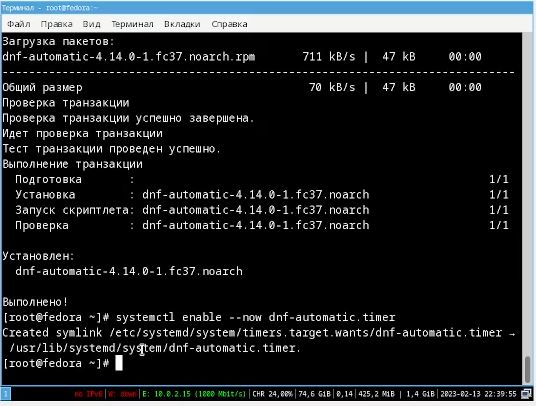
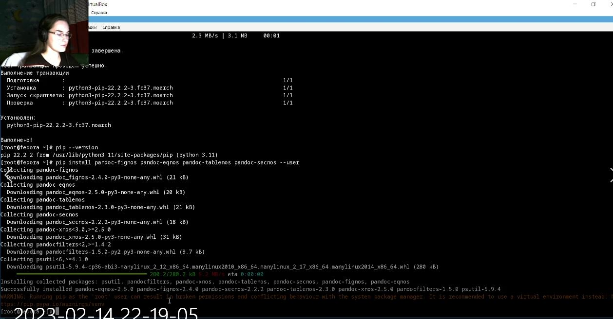

---
## Front matter
title: "Отчёт по лабораторной работе 1"
subtitle: "Установка ОС Linux"
author: "Сидорова Наталья Андреевна"

## Generic otions
lang: ru-RU
toc-title: "Содержание"

## Bibliography
bibliography: bib/cite.bib
csl: pandoc/csl/gost-r-7-0-5-2008-numeric.csl

## Pdf output format
toc: true # Table of contents
toc-depth: 2
lof: true # List of figures
lot: true # List of tables
fontsize: 12pt
linestretch: 1.5
papersize: a4
documentclass: scrreprt
## I18n polyglossia
polyglossia-lang:
  name: russian
  options:
	- spelling=modern
	- babelshorthands=true
polyglossia-otherlangs:
  name: english
## I18n babel
babel-lang: russian
babel-otherlangs: english
## Fonts
mainfont: PT Serif
romanfont: PT Serif
sansfont: PT Sans
monofont: PT Mono
mainfontoptions: Ligatures=TeX
romanfontoptions: Ligatures=TeX
sansfontoptions: Ligatures=TeX,Scale=MatchLowercase
monofontoptions: Scale=MatchLowercase,Scale=0.9
## Biblatex
biblatex: true
biblio-style: "gost-numeric"
biblatexoptions:
  - parentracker=true
  - backend=biber
  - hyperref=auto
  - language=auto
  - autolang=other*
  - citestyle=gost-numeric
## Pandoc-crossref LaTeX customization
figureTitle: "Рис."
tableTitle: "Таблица"
listingTitle: "Листинг"
lofTitle: "Список иллюстраций"
lotTitle: "Список таблиц"
lolTitle: "Листинги"
## Misc options
indent: true
header-includes:
  - \usepackage{indentfirst}
  - \usepackage{float} # keep figures where there are in the text
  - \floatplacement{figure}{H} # keep figures where there are in the text
---

# Цель работы

Приобретение практических навыков установки операционной системы на виртуальную машину, настройки минимально необходимых для дальнейшей работы сервисов.

# Задание

1. Запуск VirtualBox и создание новой виртуальной машины
2. Настройка установки операционной системы
3. Подключение образа диска дополнений гостевой ОС
4. Выполнение домашнего задания

# Теоретическое введение

Операционная система - комплекс взаимосвязанных программ, действующий как интерфейс между приложениями и пользователями с одной стороны, и аппаратурой компьютера с другой стороны.

VirtualBox - специальное средство, позволяющее запускать операционную систему внутри другой.

# Выполнение лабораторной работы

Задала имя операционной машине, ее местоположение и операционную систему, необходимый вариант Федоры (рис. @fig:001).

{#fig:001 width=70%}

Указала размер основной памяти - 2048Мб (рис. @fig:002).

{#fig:002 width=70%}

Создала новый виртуальный жесткий диск размером 80 Гб (рис. @fig:003).

{#fig:003 width=70%}

Добавила новый оптический привод и выбрала образ Fedora (рис. @fig:004).

{#fig:004 width=70%}

Настроила комбинацию клавиш "Win"+"Enter" для открытия терминала рис. @fig:005).

{#fig:005 width=70%}

В терминале ввела команду liveinst и начала установку (рис. @fig:006).

{#fig:006 width=70%}

Выбрала язык интерфейса русский (рис. @fig:007).

{#fig:007 width=70%}

Раскладка клавиатуры - английская и русская (рис. @fig:008).

{#fig:008 width=70%}

Создала аккаунт администратора (рис. @fig:009).

{#fig:009 width=70%}

Создала пользователя, его имя соответствует требованиям соглашения об именовании (рис. @fig:010).

{#fig:010 width=70%}

Все необходимые настройки для установки выполнены (рис. @fig:011).

{#fig:011 width=70%}

Установка Fedora завершена (рис. @fig:012).

{#fig:012 width=70%}

Оптический диск не отключился автоматически, поэтому я отключила его вручную (рис. @fig:013).

{#fig:013 width=70%}

Переключилась на роль суперпользователя и обновила все пакеты (рис. @fig:014).

{#fig:014 width=70%}

Установила программы для удобства работы в консоли (рис. @fig:015).

{#fig:015 width=70%}

Установила программное обеспечение (рис. @fig:016).

{#fig:016 width=70%}

Запустила таймер (рис. @fig:017).

{#fig:017 width=70%}

Отключила систему безопасности SELinux (рис. @fig:018).

{#fig:018 width=70%}

Установила пакет dkms (рис. @fig:019).

{#fig:019 width=70%}

Подключила образ диска дополнений гостевой ОС (рис. @fig:020).

{#fig:020 width=70%}

Подмонтировала диск и установила драйвера (рис. @fig:021).

{#fig:021 width=70%}

Настроила раскладку клавиатуры, отредактировав конфигурационный файл (рис. @fig:022).

{#fig:022 width=70%}

Имя хоста установлено в соответствии с соглашением об именовании (рис. @fig:023).

{#fig:023 width=70%}

Установила pandoc (рис. @fig:024).

{#fig:024 width=70%}

Установила необходимые расширения (рис. @fig:025).

{#fig:025 width=70%}

Установтила дистрибутив TeXlive (рис. @fig:026).

{#fig:026 width=70%}

Выполнение домашнего задания:
С помощью команды dmesg | grep -i "то, что ищем", получила информацию о версии ядра Linux (Linux version), частоте процессора (Detected Mhz processor), модели процессора (CPU0) (рис. @fig:027).

{#fig:027 width=70%}

Получила информацию об объёме доступной оперативной памяти (Memory available) (рис. @fig:028).

{#fig:028 width=70%}

Получила информацию о типе обнаруженного гипервизора (Hypervisor detected) (рис. @fig:029).

{#fig:029 width=70%}

Получила информацию о последовательности монтирования файловых систем (рис. @fig:030).

{#fig:030 width=70%}

Получила информацию о типе файловой системы корневого раздела - btrfs (рис. @fig:031).

{#fig:031 width=70%}

1. Какую информацию содержит учётная запись пользователя?
Имя пользователя, пароль пользователя, идентификационный номер пользователя, идентификационный номер группы пользователя, домашний каталог пользователя, командный интерпретатор пользователя.

Укажите команды терминала и приведите примеры:

для получения справки по команде: man <название команды>
для перемещения по файловой системе: cd
для просмотра содержимого каталога: ls
для определения объёма каталога: du <имя каталога>
для создания файлов: touch
для удаления каталогов: rm <имя каталога>
для удаления файлов: rm -r <имя файла>
для задания определённых прав на файл / каталог: chmod +x <имя файла/каталога>
для просмотра истории команд: history

Что такое файловая система? Приведите примеры с краткой характеристикой.
Файловая система - часть ОС, назначение которой состоит в том, чтобы обеспечить пользователю удобный интерфейс при работе с данными, хранящимися на диске, и обеспечить совместное использование файлов несколькими пользователями и процессами.
Примеры:
1. Ext2, Ext3, Ext4, Extended Filesystem - стандартные файловые системы для Linux
2. JFS - разработана в IBM для UNIX и используется в качестве альтернативы файловых систем Ext. Используется при необходимости высокой стабильности и минимального потребления ресурсов
3. ReiserFS - разработана в качестве альтернативы Ext3 с улучшенной производительностью и расширенными возможностями.
4. XFS - высокопроизводительная файловая система. Характеризуется высокой скоростью работы с большими файлами, отложенным выделением места, увеличением разделов на лету и незначительным размером служебной информации.

Как посмотреть, какие файловые системы подмонтированы в ОС?
Используя команду mount.

Как удалить зависший процесс?
Используя команду kill.

# Выводы

В ходе выполнения лабораторной работы я приобрела навыки установки операционной системы на виртуальную машину, настройки минимально необходимых для дальнейшей работы сервисов.

# Список литературы{.unnumbered}
1. Кулябов Д.С. Введение в операционную систему UNIX - Лекция.
::: {#refs}
:::
