---
## Front matter
title: "Отчёт по лабораторной работе 2"
subtitle: "Первоначальная настройка git"
author: "Сидорова Наталья Андреевна"

## Generic otions
lang: ru-RU
toc-title: "Содержание"

## Bibliography
bibliography: bib/cite.bib
csl: pandoc/csl/gost-r-7-0-5-2008-numeric.csl

## Pdf output format
toc: true # Table of contents
toc-depth: 2
lof: true # List of figures
lot: true # List of tables
fontsize: 12pt
linestretch: 1.5
papersize: a4
documentclass: scrreprt
## I18n polyglossia
polyglossia-lang:
  name: russian
  options:
	- spelling=modern
	- babelshorthands=true
polyglossia-otherlangs:
  name: english
## I18n babel
babel-lang: russian
babel-otherlangs: english
## Fonts
mainfont: PT Serif
romanfont: PT Serif
sansfont: PT Sans
monofont: PT Mono
mainfontoptions: Ligatures=TeX
romanfontoptions: Ligatures=TeX
sansfontoptions: Ligatures=TeX,Scale=MatchLowercase
monofontoptions: Scale=MatchLowercase,Scale=0.9
## Biblatex
biblatex: true
biblio-style: "gost-numeric"
biblatexoptions:
  - parentracker=true
  - backend=biber
  - hyperref=auto
  - language=auto
  - autolang=other*
  - citestyle=gost-numeric
## Pandoc-crossref LaTeX customization
figureTitle: "Рис."
tableTitle: "Таблица"
listingTitle: "Листинг"
lofTitle: "Список иллюстраций"
lotTitle: "Список таблиц"
lolTitle: "Листинги"
## Misc options
indent: true
header-includes:
  - \usepackage{indentfirst}
  - \usepackage{float} # keep figures where there are in the text
  - \floatplacement{figure}{H} # keep figures where there are in the text
---

# Цель работы

Изучить идеологию и применение средств контроля версий. Освоить умения по работе с git.

# Задание

1. Зарегистрироваться на Github
2. Создать базовую конфигурацию для работы с git
3. Создать ключ SSH
4. Создать ключ PGP
5. Настроить подписи git
6. Создать локальный каталог для выполнения заданий по предмету

# Теоретическое введение

Системы контроля версий применяются при работе нескольких человек над одним проектом. Основное дерево хранится на репозитории. При внесении изменений в содержание проекта система контроля версий позволяет их фиксировать, мовмещать изменения от разных участников проекта.

# Выполнение лабораторной работы

Установила git и gh (рис. @fig:001).

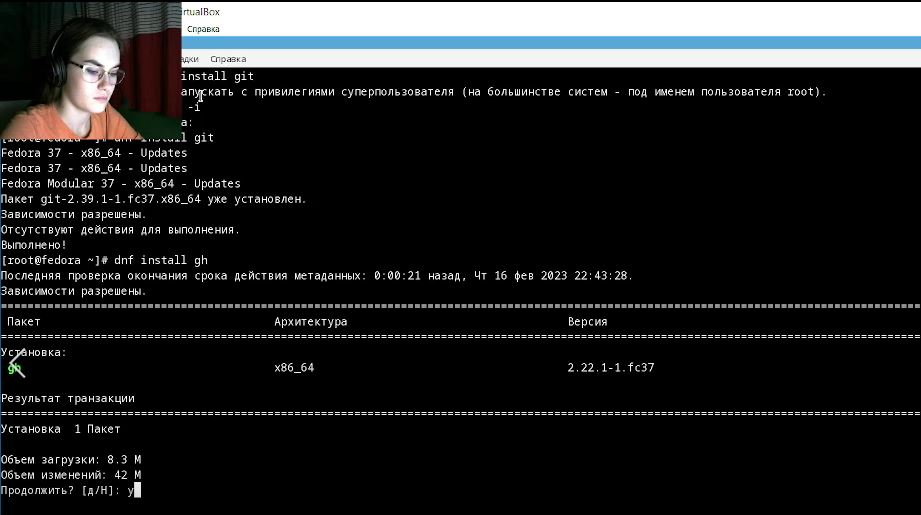{#fig:001 width=70%}

Произвела базовую настройку git - задала имя и email владельца репозитория, настроила utf-8 в выводе сообщений git, задала имя начальной ветки(master), задала параметр autocrlf и параметр safecrlf (рис. @fig:002).

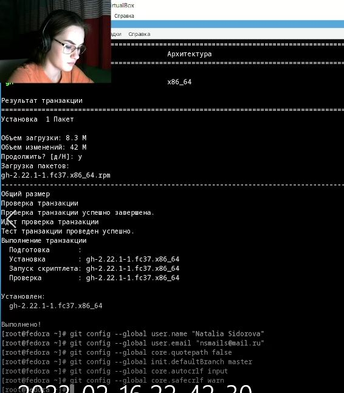{#fig:002 width=70%}

Создала ключи SSH - по алгоритму rsa и по алгоритму ed25519 (рис. @fig:003).

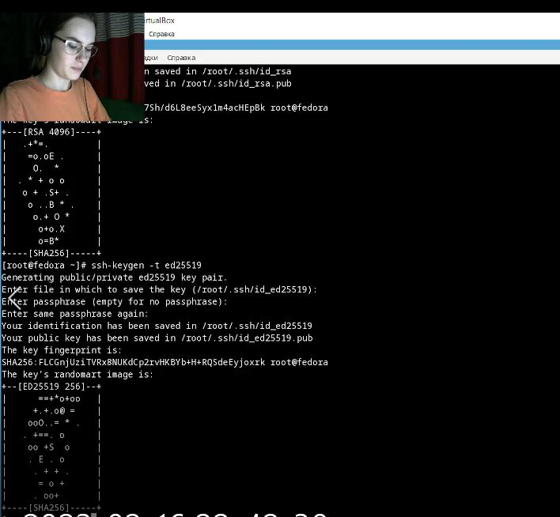{#fig:003 width=70%}

Создала ключ pgp (рис. @fig:004).

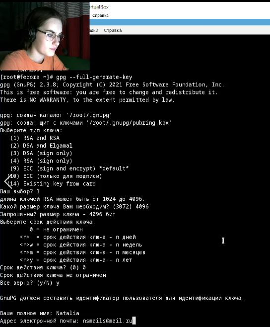{#fig:004 width=70%}

Учетная запись на Github уже была создана (рис. @fig:005).

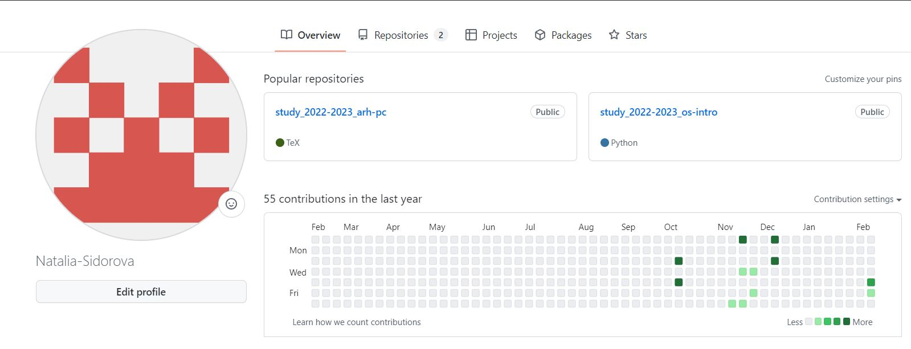{#fig:005 width=70%}

Скопировала отпечаток приватного ключа (рис. @fig:006).

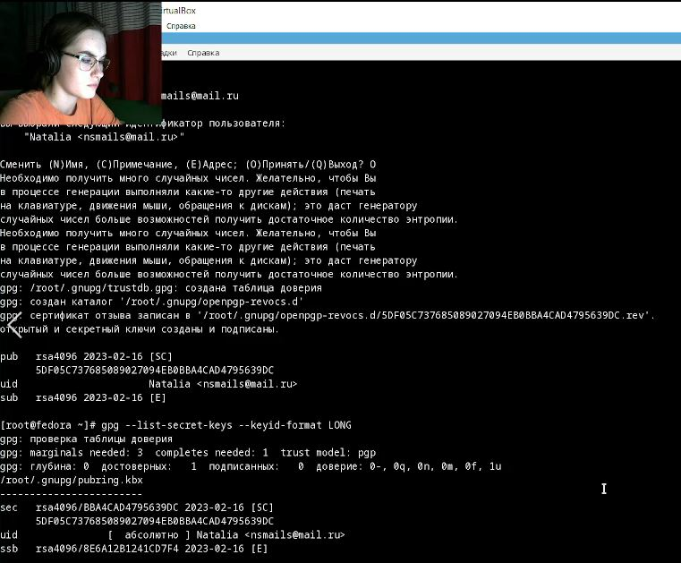{#fig:006 width=70%}

Добавила скопированный ключ в Github (рис. @fig:007).

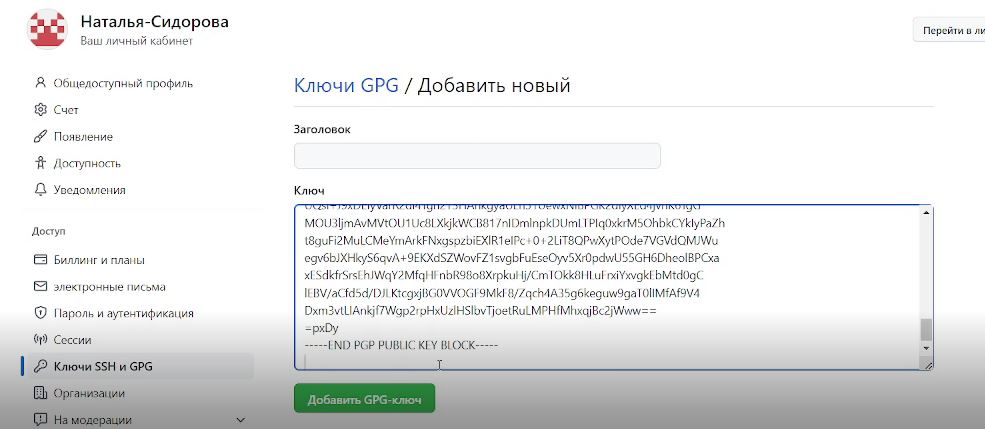{#fig:007 width=70%}

Настроила gh (рис. @fig:008).

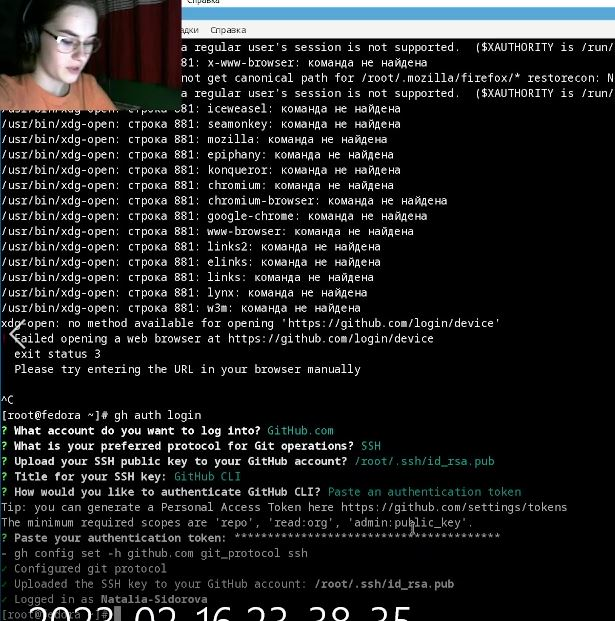{#fig:008 width=70%}

Настроила автоматические подписи коммитов git (рис. @fig:009).

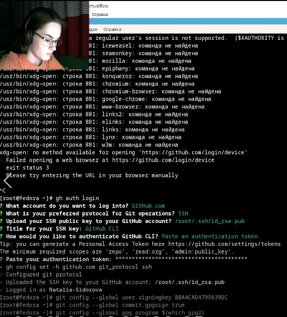{#fig:009 width=70%}

Создала репозиторий курса на основе шаблона (рис. @fig:010).

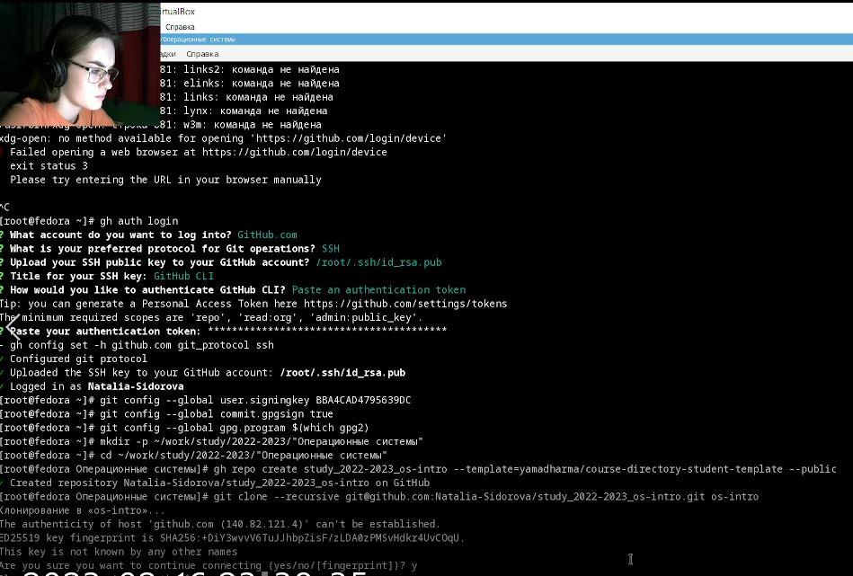{#fig:010 width=70%}

Настроила каталог курса (рис. @fig:011).

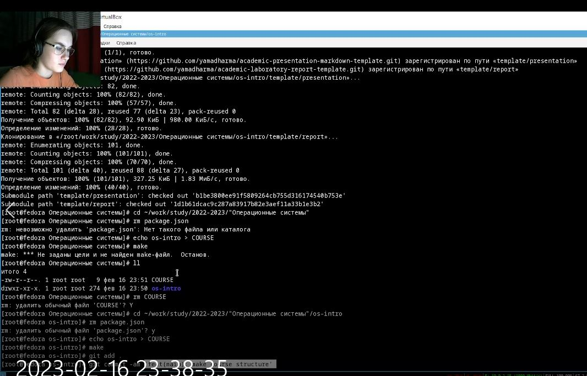{#fig:011 width=70%}

Отправила файлы на сервер (рис. @fig:012).

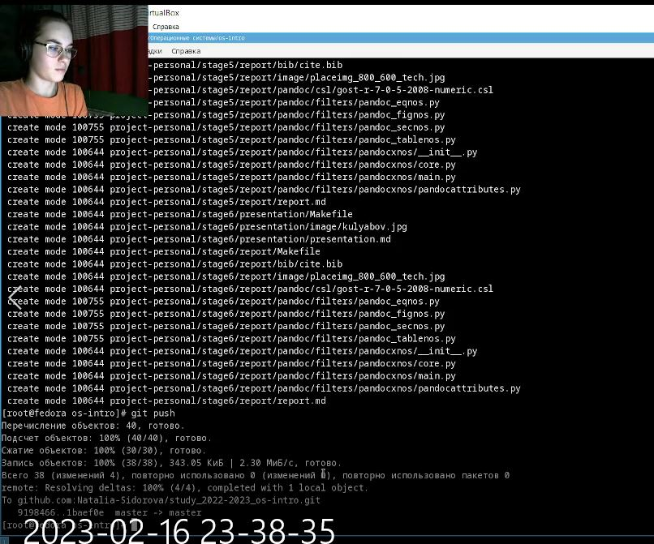{#fig:012 width=70%}

Ответы на контрольные вопросы:

Что такое системы контроля версий (VCS) и для решения каких задач они предназначаются?
Система контроля версий - ПО для облегчения работы с изменяющейся информацией. Система управления версиями позволяет хранить несколько версий одного и того же документа, при необходимости возвращаться к более ранним версиям. Системы контроля версий применяются для хранения полной истории изменений, причин всех производимых изменений, откат изменений, поиск причины ошибок в программе, совместная работа группы над проектом.

Объясните следующие понятия VCS и их отношения: хранилище, commit, история, рабочая копия.
Репозиторий - хранилище версий. В нем хранятся все документы с историей их изменения, а также другая служебная информация.
Сommit - отслеживание изменений, сохраняет разницу в изменениях.
Рабочая копия - копия проекта, связанная с репозиторием (текущее состояние файлов проекта)
История - хранит все изменения в проекте и позволяет обратиться к необходимым данным.

Что представляют собой и чем отличаются централизованные и децентрализованные VCS? Приведите примеры VCS каждого вида.
Централизованные VCS - Subversion, CVS, TFS, VAULT, AccuRev: одно основное хранилище всего проекта, каждый пользователь копирует себе необходимые файлы, изменяет их и добалвяет эти изменения обратно.
Децентрализованные VCS - Git, Mercurial, Bazaar: у каждого пользователя свой вариант репозитория, есть возможность добавлять и забирать изменения из любого репозиторияБ в классических системах контроля версий используется централизованная модель, предполагающая наличие единого репозитория для хранения файловБ центральный репозиторий не является обязательным, выполнение большинства функций по управлению версиями осуществляется специальным сервером.

Опишите действия с VCS при единоличной работе с хранилищем.
Создаем и подключаем удаленный репозиторий. Затем по мере изменения проекта отправляем изменения на сервер.

Опишите порядок работы с общим хранилищем VCS.
Пользователь преред началом работы получает нужную ему версию файлов. После внесения изменений пользователь размещает новую версию в хранилище. Предыдущие версии не удаляются.
 
Каковы основные задачи, решаемые инструментальным средством git?
Хранить информацию о всех изменениях в коде и обеспечение удобства командной работы над кодом.

Назовите и дайте краткую характеристику командам git.
git init создание основого дерева репозитория
git pull получение изменений текущего дерева из центрального репозитория
git push - отправка всех произведенных изменений локального дерева в центральный репозиторий
git status - просмотр списка измененных файлов в текущей директории
git diff - просмотр текущих изменений
git add. - добавить измененные файлы/каталоги
git rm - удаление файла/каталога из индекса репозитория
git commit -am'Описание коммита' - сохранить все добавленные изменения и все измененные файлы
git checkout -b имя ветки - создание новой ветки, базирующейся на текущей
git push origin имя ветки - отправка изменений конкретной ветки в центральный репозиторий
git merge -no-ff имя ветки - слияние ветки с текущим деревом
git branch -d имя ветки - удаление локальной уже слитой с основным деревом ветки
git branch -D имя ветки - принудительное удаления локальной ветки
git push origin:имя ветки - удаление ветки с центрального репозитория

Приведите примеры использования при работе с локальным и удалённым репозиториями.
git push -all(push origin master/branch)

Что такое и зачем могут быть нужны ветви (branches)?
Ветвление - один из параллельных участков истории в одном хранилище, исходящих из одной версии. Обычно есть главная ветка (ствол), между ветками возможно слияние. Используются для разработки новых функций.

Как и зачем можно игнорировать некоторые файлы при commit?
Во время работы над проектом могут создаваться файлы, которые не требуется добавлять в репозиторий. Можно прописать шаблоны игнорируемых при добавлении в репозиторий типов файлов в файл .gitignore.

# Выводы

В ходе проделанной работы я изучила средства контроля версий и научилась применять их, освоила работу с git, научилась подключать репозитории, добавлять и удалять файлы.

# Список литературы{.unnumbered}
1. О системе контроля версий [Электронный ресурс]. 2016. URL:
https://git-scm.com/book/ru/v2/Введение-О-системе-контроля-версий .
2. Системы контроля версий [Электронный ресурс]. 2016. URL:
http://uii.mpei.ru/study/courses/sdt/16/lecture02.2_vcs.slides.pdf .
::: {#refs}
:::
