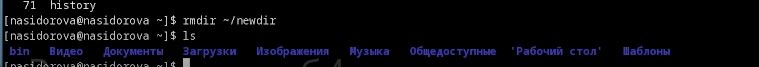

---
## Front matter
title: "Отчёт по лабораторной работе 4"
subtitle: "Основы интерфейса взаимодействия пользователя с системой Unix на уровне командной строки"
author: "Сидорова Наталья Андреевна"

## Generic otions
lang: ru-RU
toc-title: "Содержание"

## Bibliography
bibliography: bib/cite.bib
csl: pandoc/csl/gost-r-7-0-5-2008-numeric.csl

## Pdf output format
toc: true # Table of contents
toc-depth: 2
lof: true # List of figures
lot: true # List of tables
fontsize: 12pt
linestretch: 1.5
papersize: a4
documentclass: scrreprt
## I18n polyglossia
polyglossia-lang:
  name: russian
  options:
	- spelling=modern
	- babelshorthands=true
polyglossia-otherlangs:
  name: english
## I18n babel
babel-lang: russian
babel-otherlangs: english
## Fonts
mainfont: PT Serif
romanfont: PT Serif
sansfont: PT Sans
monofont: PT Mono
mainfontoptions: Ligatures=TeX
romanfontoptions: Ligatures=TeX
sansfontoptions: Ligatures=TeX,Scale=MatchLowercase
monofontoptions: Scale=MatchLowercase,Scale=0.9
## Biblatex
biblatex: true
biblio-style: "gost-numeric"
biblatexoptions:
  - parentracker=true
  - backend=biber
  - hyperref=auto
  - language=auto
  - autolang=other*
  - citestyle=gost-numeric
## Pandoc-crossref LaTeX customization
figureTitle: "Рис."
tableTitle: "Таблица"
listingTitle: "Листинг"
lofTitle: "Список иллюстраций"
lotTitle: "Список таблиц"
lolTitle: "Листинги"
## Misc options
indent: true
header-includes:
  - \usepackage{indentfirst}
  - \usepackage{float} # keep figures where there are in the text
  - \floatplacement{figure}{H} # keep figures where there are in the text
---

# Цель работы

Приобретение практических навыков взаимодействия пользователя с системой посредством командной строки

# Задание

1. Определите полное имя вашего домашнего каталога. Далее относительно этого каталога будут выполняться последующие упражнения.
2. Выполните следующие действия:
2.1. Перейдите в каталог /tmp.
2.2. Выведите на экран содержимое каталога /tmp. Для этого используйте команду ls
с различными опциями. Поясните разницу в выводимой на экран информации.
2.3. Определите, есть ли в каталоге /var/spool подкаталог с именем cron?
2.4. Перейдите в Ваш домашний каталог и выведите на экран его содержимое. Определите, кто является владельцем файлов и подкаталогов?
3. Выполните следующие действия:
3.1. В домашнем каталоге создайте новый каталог с именем newdir.
3.2. В каталоге ~/newdir создайте новый каталог с именем morefun.
3.3. В домашнем каталоге создайте одной командой три новых каталога с именами
letters, memos, misk. Затем удалите эти каталоги одной командой.
3.4. Попробуйте удалить ранее созданный каталог ~/newdir командой rm. Проверьте,
был ли каталог удалён.
3.5. Удалите каталог ~/newdir/morefun из домашнего каталога. Проверьте, был ли
каталог удалён.
4. С помощью команды man определите, какую опцию команды ls нужно использовать для просмотра содержимое не только указанного каталога, но и подкаталогов,
входящих в него.
5. С помощью команды man определите набор опций команды ls, позволяющий отсортировать по времени последнего изменения выводимый список содержимого каталога
с развёрнутым описанием файлов.
6. Используйте команду man для просмотра описания следующих команд: cd, pwd, mkdir,
rmdir, rm. Поясните основные опции этих команд.
7. Используя информацию, полученную при помощи команды history, выполните модификацию и исполнение нескольких команд из буфера команд.

# Теоретическое введение

В операционной системе типа Linux взаимодействие пользователя с системой обычно
осуществляется с помощью командной строки посредством построчного ввода команд. При этом обычно используется командные интерпретаторы языка shell: /bin/sh;
/bin/csh; /bin/ksh.
Формат команды. Командой в операционной системе называется записанный по
специальным правилам текст (возможно с аргументами), представляющий собой указание на выполнение какой-либо функций (или действий) в операционной системе.
Обычно первым словом идёт имя команды, остальной текст — аргументы или опции,
конкретизирующие действие.
Общий формат команд можно представить следующим образом:
<имя_команды><разделитель><аргументы>

# Выполнение лабораторной работы

Определила полное имя моего домашнего каталога c помощью команды pwd (рис. @fig:001).

{#fig:001 width=70%}

Перешла в каталог /tmp с помощью команды cd и вывела на экран его содержимое с помощью команды ls. Затем перешла в каталог /var/spool и посмотрела его содержимое. Данный каталог содержит подкаталог с именем cron (рис. @fig:002).

{#fig:002 width=70%}

Перешла в свой домашний каталог и вывела на экран его содержимое. Определила, что владельцем файлов и подкаталогов является nasidorova (рис. @fig:003).

{#fig:003 width=70%}

В домашнем каталоге создала новый каталог с именем newdir. В каталоге ~/newdir создала новый каталог с именем morefun. В домашнем каталоге создала одной командой три новых каталога с именами letters, memos, misk (рис. @fig:004).

{#fig:004 width=70%}

Удалила каталоги letters, memos, misk с помощью команды rmdir. При помощи команды rm удалить каталог newdir не удалось, эта команда удалет только файлы. Удалила каталог ~/newdir/morefun из домашнего каталога (рис. @fig:005).

{#fig:005 width=70%}

С помощью команды man определила, что для отсортировки по времени последнего изменения выводимый список содержимого каталога с развёрнутым описанием файлов необходимо использовать команду ls с набором опций -ltc (рис. @fig:006).

{#fig:006 width=70%}

С помощью команды man определила, что для просмотра содержимого не только указанного каталога, но и подкаталогов, входящих в него необходимо использовать команду ls с опцией -R (рис. @fig:007).

{#fig:007 width=70%}

С помощью команды man просмотрела описание команды cd. Например рассмотрим опцию -f "filename" - она читает строящие ключи из данного файла. 
Опция -q "functoin" - делает запрос о том, какие клавиши вызвают названную функцию (рис. @fig:008).

{#fig:008 width=70%}

С помощью команды man просмотрела описание команды pwd. Например рассмотрим опцию -P - она избегает всех символических ссылок. Опция --help показывает эту справку и существование (рис. @fig:009).

{#fig:009 width=70%}

С помощью команды man просмотрела описание команды mkdir. Опция -v выводит сообщение для каждого созданного каталога (рис. @fig:010).

{#fig:010 width=70%}

С помощью команды man просмотрела описание команды rmdir. Опция -p удаляет каталог и его предшествующие каталоги (рис. @fig:011).

{#fig:011 width=70%}

С помощью команды man просмотрела описание команды rm. Опция -i подсказывает перед каждым удалением (рис. @fig:012).

{#fig:012 width=70%}

Использовала команду history и получила список ранее вводимых команд. Модифицировала команду rm ~/newdir в rmdir ~/newdir и удалила каталог newdir (рис. @fig:013).

{#fig:013 width=70%}

Контрольные вопросы:
1. Что такое командная строка? командная строка - текстовый интерфейс между человеком и компьютером, в котором инструкции компьютеру даются путем ввода с клавиатуры текстовых строк - команд
2. При помощи какой команды можно определить абсолютный путь текущего каталога? Команда pwd.
Приведите пример. Абсолютное имя текущего каталога пользователя dharmа: /afs/dk.sci.pfu.edu.ru/home/d/h/dharma
3. При помощи какой команды и каких опций можно определить только тип файлов
и их имена в текущем каталоге? Приведите примеры. Команда ls -F. Пример: в своем домашнем каталоге выполнила эту команду: bin/   Видео/   Документы/   Загрузки/   Изображения/   Музыка/   Общедоступные/  'Рабочий стол'/   Шаблоны/
4. Каким образом отобразить информацию о скрытых файлах? Приведите примеры. Команда ls -a. Пример:  .               .bash_logout    bin       .lesshst   .ssh                          .vboxclient-seamless.pid              .xsession-errors.old   Загрузки      Общедоступные
 ..              .bash_profile   .cache    .local     .vboxclient-clipboard.pid     .vboxclient-vmsvga-session-tty1.pid   Видео                  Изображения  'Рабочий стол'
 .bash_history   .bashrc         .config   .mozilla   .vboxclient-draganddrop.pid   .xsession-errors                      Документы              Музыка        Шаблоны

5. При помощи каких команд можно удалить файл и каталог? Можно ли это сделать
одной и той же командой? Приведите примеры. Команда rm удаляет файлы, для удаления непустых каталогов можно использовать rm -r. Для пустых каталогов применяют rmdir.
6. Каким образом можно вывести информацию о последних выполненных пользователем командах? работы? С помощью команды history
7. Как воспользоваться историей команд для их модифицированного выполнения? Приведите примеры. Можно модифицировать команду из выведенного на экране списка с помощью конструкции: !<номер_команды>:s/<что_меняем>/<на_что_меняем>
8. Приведите примеры запуска нескольких команд в одной строке. Если необходимо последовательно выполнить несколько команд, записанных в одной строке, то для этого используется символ ";"
9. Дайте определение и приведите примера символов экранирования. Если встречаются специальные символы, то перед ними ставится символ "/"
10. Охарактеризуйте вывод информации на экран после выполнения команды ls с опцией 
l. Чтобы вывести на экран подробную информацию о файлах и каталогах, необходимо использовать опцию |. О каждом файле или каталоге будет выведена информация : -тип файла, - право доступа, -число ссылок, -владелец, -размер, -дата последней ревизии, -имя файла или каталога
11. Что такое относительный путь к файлу? Приведите примеры использования относительного и абсолютного пути при выполнении какой-либо команды. Относительный путь - ссылка, указывающая на другие страницы вашего сайта относительно веб-страницы, на которой эта ссылка уже находится.  Пример: work/study/2022-2023/Операционные системы/os-intro
12. Как получить информацию об интересующей вас команде? Команда hepl
13. Какая клавиша или комбинация клавиш служит для автоматического дополнения
вводимых команд? Клавиша Tab

# Выводы

В ходе проделанной работы я научилась работать с командной строкой, изучила различные команды и применила их.

# Список литературы{.unnumbered}

::: {#refs}
:::

