---
## Front matter
title: "Отчёт по лабораторной работе 5"
subtitle: "Анализ файловой системы Linux. Команды для работы с файлами и каталогами"
author: "Сидорова Наталья Андреевна"

## Generic otions
lang: ru-RU
toc-title: "Содержание"

## Bibliography
bibliography: bib/cite.bib
csl: pandoc/csl/gost-r-7-0-5-2008-numeric.csl

## Pdf output format
toc: true # Table of contents
toc-depth: 2
lof: true # List of figures
lot: true # List of tables
fontsize: 12pt
linestretch: 1.5
papersize: a4
documentclass: scrreprt
## I18n polyglossia
polyglossia-lang:
  name: russian
  options:
	- spelling=modern
	- babelshorthands=true
polyglossia-otherlangs:
  name: english
## I18n babel
babel-lang: russian
babel-otherlangs: english
## Fonts
mainfont: PT Serif
romanfont: PT Serif
sansfont: PT Sans
monofont: PT Mono
mainfontoptions: Ligatures=TeX
romanfontoptions: Ligatures=TeX
sansfontoptions: Ligatures=TeX,Scale=MatchLowercase
monofontoptions: Scale=MatchLowercase,Scale=0.9
## Biblatex
biblatex: true
biblio-style: "gost-numeric"
biblatexoptions:
  - parentracker=true
  - backend=biber
  - hyperref=auto
  - language=auto
  - autolang=other*
  - citestyle=gost-numeric
## Pandoc-crossref LaTeX customization
figureTitle: "Рис."
tableTitle: "Таблица"
listingTitle: "Листинг"
lofTitle: "Список иллюстраций"
lotTitle: "Список таблиц"
lolTitle: "Листинги"
## Misc options
indent: true
header-includes:
  - \usepackage{indentfirst}
  - \usepackage{float} # keep figures where there are in the text
  - \floatplacement{figure}{H} # keep figures where there are in the text
---

# Цель работы

Ознакомление с файловой системой Linux, её структурой, именами и содержанием
каталогов. Приобретение практических навыков по применению команд для работы
с файлами и каталогами, по управлению процессами (и работами), по проверке использования диска и обслуживанию файловой системы.

# Задание

1. Выполните все примеры, приведённые в первой части описания лабораторной работы.
2. Выполните следующие действия, зафиксировав в отчёте по лабораторной работе
используемые при этом команды и результаты их выполнения:
2. 1. Скопируйте файл /usr/include/sys/io.h в домашний каталог и назовите его
equipment. Если файла io.h нет, то используйте любой другой файл в каталоге
/usr/include/sys/ вместо него.
2. 2. В домашнем каталоге создайте директорию ~/ski.plases.
2. 3. Переместите файл equipment в каталог ~/ski.plases.
2. 4. Переименуйте файл ~/ski.plases/equipment в ~/ski.plases/equiplist.
2. 5. Создайте в домашнем каталоге файл abc1 и скопируйте его в каталог
~/ski.plases, назовите его equiplist2.
2. 6. Создайте каталог с именем equipment в каталоге ~/ski.plases.
2. 7. Переместите файлы ~/ski.plases/equiplist и equiplist2 в каталог
~/ski.plases/equipment.
2. 8. Создайте и переместите каталог ~/newdir в каталог ~/ski.plases и назовите
его plans.
3. Определите опции команды chmod, необходимые для того, чтобы присвоить перечисленным ниже файлам выделенные права доступа, считая, что в начале таких прав
нет:
3. 1. drwxr--r-- ... australia
3. 2. drwx--x--x ... play
3. 3. -r-xr--r-- ... my_os
3. 4. -rw-rw-r-- ... feathers
При необходимости создайте нужные файлы.
4. Проделайте приведённые ниже упражнения, записывая в отчёт по лабораторной
работе используемые при этом команды:
4. 1. Просмотрите содержимое файла /etc/password.
4. 2. Скопируйте файл ~/feathers в файл ~/file.old.
4. 3. Переместите файл ~/file.old в каталог ~/play.
4. 4. Скопируйте каталог ~/play в каталог ~/fun.
4. 5. Переместите каталог ~/fun в каталог ~/play и назовите его games.
4. 6. Лишите владельца файла ~/feathers права на чтение.
4. 7. Что произойдёт, если вы попытаетесь просмотреть файл ~/feathers командой
cat?
4. 8. Что произойдёт, если вы попытаетесь скопировать файл ~/feathers?
4. 9. Дайте владельцу файла ~/feathers право на чтение.
4. 10. Лишите владельца каталога ~/play права на выполнение.
4. 11. Перейдите в каталог ~/play. Что произошло?
4. 12. Дайте владельцу каталога ~/play право на выполнение.
5. Прочитайте man по командам mount, fsck, mkfs, kill и кратко их охарактеризуйте,
приведя примеры.

# Теоретическое введение

Для создания текстового файла можно использовать команду touch.
Для просмотра файлов небольшого размера можно использовать команду cat.
Для просмотра файлов постранично удобнее использовать команду less.
Команда head выводит по умолчанию первые 10 строк файла.
Команда tail выводит умолчанию 10 последних строк файла.
Команда cp используется для копирования файлов и каталогов.
Команды mv и mvdir предназначены для перемещения и переименования файлов
и каталогов.
Каждый файл или каталог имеет права доступа.
В сведениях о файле или каталоге указываются:
– тип файла (символ (-) обозначает файл, а символ (d) — каталог);
– права для владельца файла (r — разрешено чтение, w — разрешена запись, x — разрешено выполнение, - — право доступа отсутствует);
– права для членов группы (r — разрешено чтение, w — разрешена запись, x — разрешено
выполнение, - — право доступа отсутствует);
– права для всех остальных (r — разрешено чтение, w — разрешена запись, x — разрешено
выполнение, - — право доступа отсутствует).
Права доступа к файлу или каталогу можно изменить, воспользовавшись командой
chmod. Сделать это может владелец файла (или каталога) или пользователь с правами
администратора.
Файловая система в Linux состоит из фалов и каталогов. Каждому физическому носителю соответствует своя файловая система.
Существует несколько типов файловых систем. Перечислим наиболее часто встречающиеся типы:
– ext2fs (second extended filesystem);
– ext2fs (third extended file system);
– ext4 (fourth extended file system);
– ReiserFS;
– xfs;
– fat (file allocation table);
– ntfs (new technology file system).
Для просмотра используемых в операционной системе файловых систем можно воспользоваться командой mount без параметров.
С помощью команды fsck можно проверить (а в ряде случаев восстановить) целостность файловой системы.

# Выполнение лабораторной работы

С помощью команды touch создала файл file_name, затем удалила его командой rm (рис. @fig:001).

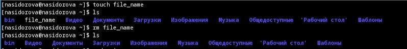{#fig:001 width=70%}

С помощью команды cat посмотрела содержимое файла Makefile (рис. @fig:002).

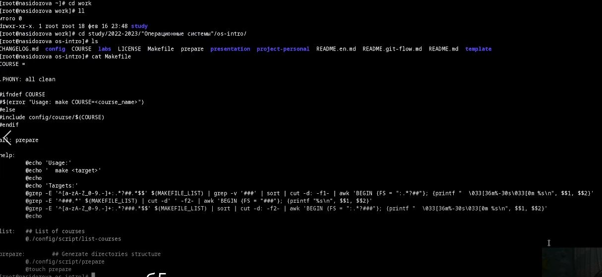{#fig:002 width=70%}

С помощью команды less постранично посмотрела содержимое файла Makefile (рис. @fig:003).

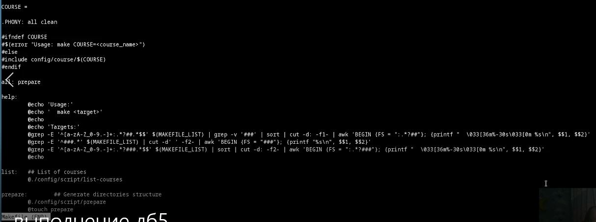{#fig:003 width=70%}

С помощью команд head и tail посмотрела начало и конец файла соответственно (рис. @fig:004).

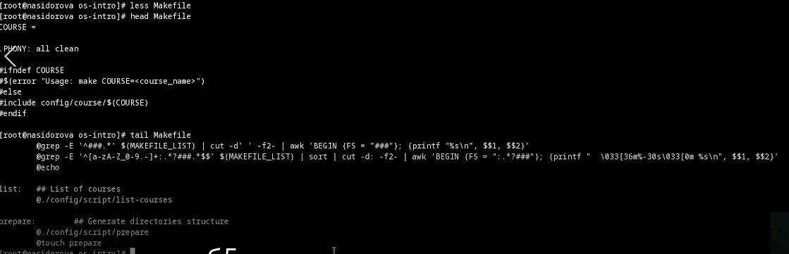{#fig:004 width=70%}

Скопировала файл /usr/include/sys/io.h в домашний каталог и назвала его equipment (рис. @fig:005).

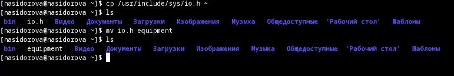{#fig:005 width=70%}

В домашнем каталоге создала директорию ~/ski.plases и переместила файл equipment в каталог ~/ski.plases (рис. @fig:006).

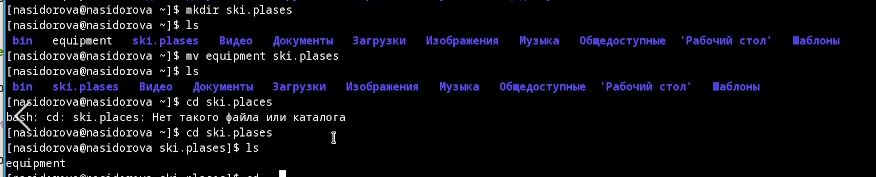{#fig:006 width=70%}

Переименовала файл ~/ski.plases/equipment в ~/ski.plases/equiplist, создала в домашнем каталоге файл abc1 и скопировала его в каталог ~/ski.plases, назвала его equiplist2, создала каталог с именем equipment в каталоге ~/ski.plases,
переместила файлы ~/ski.plases/equiplist и equiplist2 в каталог ~/ski.plases/equipment, создала и переместила каталог ~/newdir в каталог ~/ski.plases и назвала его plans (рис. @fig:007).

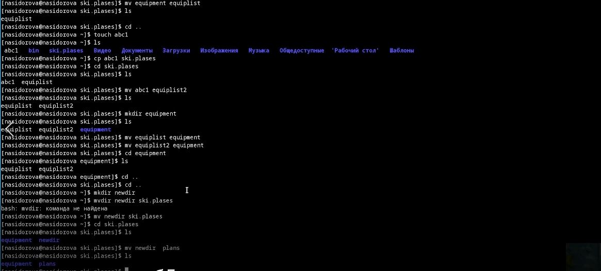{#fig:007 width=70%}

Определила необходимые опции команды chmod, присвоила перечисленным ниже файлам выделенные права доступа, считая, что в начале таких прав
нет:
3.1. drwxr--r-- ... australia
3.2. drwx--x--x ... play
3.3. -r-xr--r-- ... my_os
3.4. -rw-rw-r-- ... feathers
Создала нужные файлы и директории (рис. @fig:008).

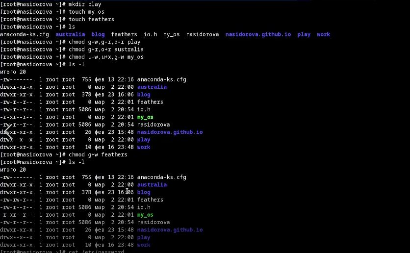{#fig:008 width=70%}

Просмотрела содержимое файла /etc/password (рис. @fig:009).

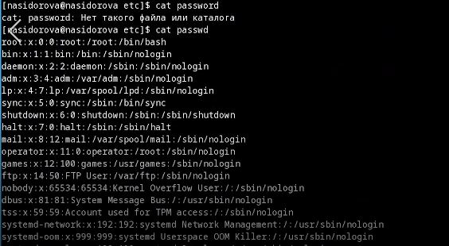{#fig:009 width=70%}

Скопировала файл ~/feathers в файл ~/file.old, переместила файл ~/file.old в каталог ~/play (рис. @fig:010).

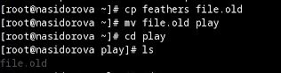{#fig:010 width=70%}

Скопировала каталог ~/play в каталог ~/fun, переместила каталог ~/fun в каталог ~/play и назвала его games, лишила владельца файла ~/feathers права на чтение, попыталась просмотреть файл ~/feathers командой cat и файл не удалось посмотреть, попыталась скопировать файл ~/feathers и получилось это сделать, дала владельцу файла ~/feathers право на чтение, лишила владельца каталога ~/play права на выполнение, перешла в каталог ~/play и ничего не произошло, дала владельцу каталога ~/play право на выполнение (рис. @fig:011).

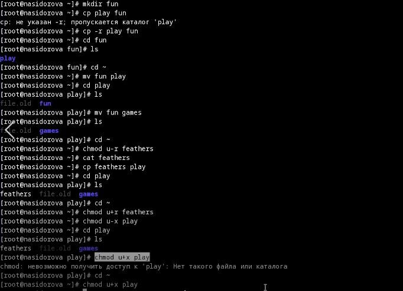{#fig:011 width=70%}

Прочитала man по команде mount и например увидела опцию -l, она добавляет ярлыки к этому списку (рис. @fig:012).

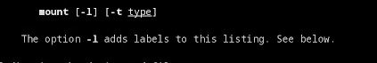{#fig:012 width=70%}

Прочитала man по команде fsck и познакомилась с опцией -Т, оне не показывает название при запуске (рис. @fig:013).

{#fig:013 width=70%}

Прочитала man по команде mkfs и обнаружила опцию -V, она показывает версию для печати и выхода (рис. @fig:014).

{#fig:014 width=70%}

Прочитала man по команде kill и увидела опцию -s, она дает сигнал для отправки, это может быть указано имя или номер (рис. @fig:015).

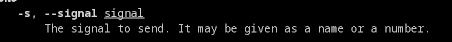{#fig:015 width=70%}

Контрольные вопросы:
1. Дайте характеристику каждой файловой системе, существующей на жёстком диске
компьютера, на котором вы выполняли лабораторную работу.
Ext2, Ext3, Ext4 или Extended Filesystem - это стандартная файловая система для Linux. Она была разработана еще для Minix. Она самая стабильная из всех существующих, кодовая база изменяется очень редко и эта файловая система содержит больше всего функций. Версия ext2 была разработана уже именно для Linux и получила много улучшений. В 2001 году вышла ext3, которая добавила еще больше стабильности благодаря использованию журналирования. В 2006 была выпущена версия ext4, которая используется во всех дистрибутивах Linux до сегодняшнего дня. В ней было внесено много улучшений, в том числе увеличен максимальный размер раздела до одного экзабайта. Btrfs или B-Tree File System - это совершенно новая файловая система, которая сосредоточена на отказоустойчивости, легкости администрирования и восстановления данных. Файловая система объединяет в себе очень много новых интересных возможностей, таких как размещение на нескольких разделах, поддержка подтомов, изменение размера не лету, создание мгновенных снимков, а также высокая производительность. Но многими пользователями файловая система Btrfs считается нестабильной. Тем не менее, она уже используется как файловая система по умолчанию в OpenSUSE и SUSE Linux.
2. Приведите общую структуру файловой системы и дайте характеристику каждой директории первого уровня этой структуры.
/ — root каталог. Содержит в себе всю иерархию системы;

/bin — здесь находятся двоичные исполняемые файлы. Основные общие команды, хранящиеся отдельно от других программ в системе (прим.: pwd, ls, cat, ps);

/boot — тут расположены файлы, используемые для загрузки системы (образ initrd, ядро vmlinuz);

/dev — в данной директории располагаются файлы устройств (драйверов). С помощью этих файлов можно взаимодействовать с устройствами. К примеру, если это жесткий диск, можно подключить его к файловой системе. В файл принтера же можно написать напрямую и отправить задание на печать;

/etc — в этой директории находятся файлы конфигураций программ. Эти файлы позволяют настраивать системы, сервисы, скрипты системных демонов;

/home — каталог, аналогичный каталогу Users в Windows. Содержит домашние каталоги учетных записей пользователей (кроме root). При создании нового пользователя здесь создается одноименный каталог с аналогичным именем и хранит личные файлы этого пользователя;

/lib — содержит системные библиотеки, с которыми работают программы и модули ядра;

/lost+found — содержит файлы, восстановленные после сбоя работы системы. Система проведет проверку после сбоя и найденные файлы можно будет посмотреть в данном каталоге;

/media — точка монтирования внешних носителей. Например, когда вы вставляете диск в дисковод, он будет автоматически смонтирован в директорию /media/cdrom;

/mnt — точка временного монтирования. Файловые системы подключаемых устройств обычно монтируются в этот каталог для временного использования;

/opt — тут расположены дополнительные (необязательные) приложения. Такие программы обычно не подчиняются принятой иерархии и хранят свои файлы в одном подкаталоге (бинарные, библиотеки, конфигурации);

/proc — содержит файлы, хранящие информацию о запущенных процессах и о состоянии ядра ОС;

/root — директория, которая содержит файлы и личные настройки суперпользователя;

/run — содержит файлы состояния приложений. Например, PID-файлы или UNIX-сокеты;

/sbin — аналогично /bin содержит бинарные файлы. Утилиты нужны для настройки и администрирования системы суперпользователем;

/srv — содержит файлы сервисов, предоставляемых сервером (прим. FTP или Apache HTTP);

/sys — содержит данные непосредственно о системе. Тут можно узнать информацию о ядре, драйверах и устройствах;

/tmp — содержит временные файлы. Данные файлы доступны всем пользователям на чтение и запись. Стоит отметить, что данный каталог очищается при перезагрузке;

/usr — содержит пользовательские приложения и утилиты второго уровня, используемые пользователями, а не системой. Содержимое доступно только для чтения (кроме root). Каталог имеет вторичную иерархию и похож на корневой;

/var — содержит переменные файлы. Имеет подкаталоги, отвечающие за отдельные переменные. Например, логи будут храниться в /var/log, кэш в /var/cache, очереди заданий в /var/spool/ и так далее.
3. Какая операция должна быть выполнена, чтобы содержимое некоторой файловой
системы было доступно операционной системе?
Монтирование тома.
4. Назовите основные причины нарушения целостности файловой системы. Как устранить повреждения файловой системы?
Отсутствие синхронизации между образом файловой системы в памяти и ее данными на диске в случае аварийного останова может привести к появлению следующих ошибок:

Один блок адресуется несколькими mode (принадлежит нескольким файлам).

Блок помечен как свободный, но в то же время занят (на него ссылается onode).

Блок помечен как занятый, но в то же время свободен (ни один inode на него не ссылается).

Неправильное число ссылок в inode (недостаток или избыток ссылающихся записей в каталогах).

Несовпадение между размером файла и суммарным размером адресуемых inode блоков.

Недопустимые адресуемые блоки (например, расположенные за пределами файловой системы).

"Потерянные" файлы (правильные inode, на которые не ссылаются записи каталогов).

Недопустимые или неразмещенные номера inode в записях каталогов.
5. Как создаётся файловая система?
mkfs - позволяет создать файловую систему Linux.
6. Дайте характеристику командам для просмотра текстовых файлов.
Cat - выводит содержимое файла на стандартное устройство вывода
7. Приведите основные возможности команды cp в Linux.
Cp – копирует или перемещает директорию, файлы.
8. Приведите основные возможности команды mv в Linux.
Mv - переименовать или переместить файл или директорию
9. Что такое права доступа? Как они могут быть изменены?
Права доступа к файлу или каталогу можно изменить, воспользовавшись командой chmod. Сделать это может владелец файла (или каталога) или пользователь с правами администратора.

# Выводы

В ходе проделанной работы я ознакомилась с файловой системой Linux, её структурой, именами и содержанием каталогов, приобрела практические навыки по применению команд для работы с файлами и каталогами, по управлению процессами (и работами), по проверке использования диска и обслуживанию файловой системы.

# Список литературы{.unnumbered}

::: {#refs}
:::
