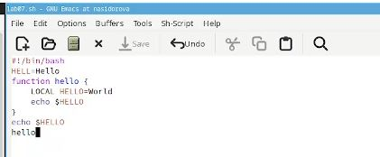
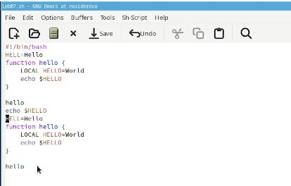
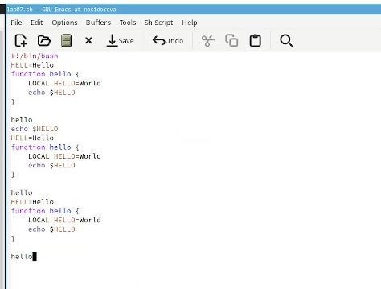
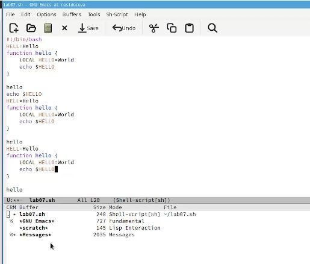
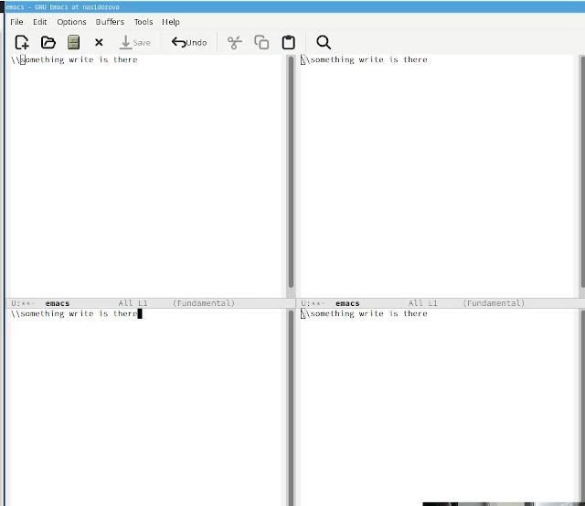
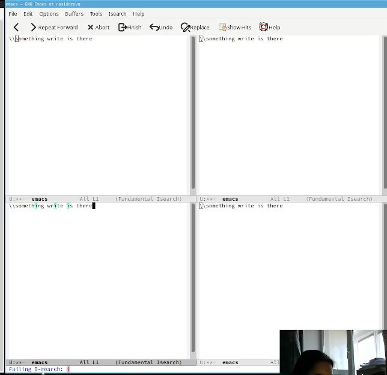

---
## Front matter
title: "Отчёт по лабораторной работе 9"
subtitle: "Текстовой редактор emacs"
author: "Сидорова Наталья Андреевна"

## Generic otions
lang: ru-RU
toc-title: "Содержание"

## Bibliography
bibliography: bib/cite.bib
csl: pandoc/csl/gost-r-7-0-5-2008-numeric.csl

## Pdf output format
toc: true # Table of contents
toc-depth: 2
lof: true # List of figures
lot: true # List of tables
fontsize: 12pt
linestretch: 1.5
papersize: a4
documentclass: scrreprt
## I18n polyglossia
polyglossia-lang:
  name: russian
  options:
	- spelling=modern
	- babelshorthands=true
polyglossia-otherlangs:
  name: english
## I18n babel
babel-lang: russian
babel-otherlangs: english
## Fonts
mainfont: PT Serif
romanfont: PT Serif
sansfont: PT Sans
monofont: PT Mono
mainfontoptions: Ligatures=TeX
romanfontoptions: Ligatures=TeX
sansfontoptions: Ligatures=TeX,Scale=MatchLowercase
monofontoptions: Scale=MatchLowercase,Scale=0.9
## Biblatex
biblatex: true
biblio-style: "gost-numeric"
biblatexoptions:
  - parentracker=true
  - backend=biber
  - hyperref=auto
  - language=auto
  - autolang=other*
  - citestyle=gost-numeric
## Pandoc-crossref LaTeX customization
figureTitle: "Рис."
tableTitle: "Таблица"
listingTitle: "Листинг"
lofTitle: "Список иллюстраций"
lotTitle: "Список таблиц"
lolTitle: "Листинги"
## Misc options
indent: true
header-includes:
  - \usepackage{indentfirst}
  - \usepackage{float} # keep figures where there are in the text
  - \floatplacement{figure}{H} # keep figures where there are in the text
---

# Цель работы

Познакомиться с операционной системой Linux. Получить практические навыки работы с редактором Emacs.

# Задание

1. Ознакомиться с теоретическим материалом.
2. Ознакомиться с редактором emacs.
3. Выполнить упражнения.
4. Ответить на контрольные вопросы.

# Теоретическое введение

Emacs представляет собой мощный экранный редактор текста, написанный на языке
высокого уровня Elisp.
Буфер — объект, представляющий какой-либо текст.
Буфер может содержать что угодно, например, результаты компиляции программы
или встроенные подсказки. Практически всё взаимодействие с пользователем, в том
числе интерактивное, происходит посредством буферов.
Фрейм соответствует окну в обычном понимании этого слова. Каждый
фрейм содержит область вывода и одно или несколько окон Emacs.
Окно — прямоугольная область фрейма, отображающая один из буферов.
Каждое окно имеет свою строку состояния, в которой выводится следующая информация: название буфера, его основной режим, изменялся ли текст буфера и как далеко вниз
по буферу расположен курсор. Каждый буфер находится только в одном из возможных
основных режимов. Существующие основные режимы включают режим Fundamental
(наименее специализированный), режим Text, режим Lisp, режим С, режим Texinfo
и другие. Под второстепенными режимами понимается список режимов, которые включены в данный момент в буфере выбранного окна.
Область вывода — одна или несколько строк внизу фрейма, в которой
Emacs выводит различные сообщения, а также запрашивает подтверждения и дополнительную информацию от пользователя.
Минибуфер используется для ввода дополнительной информации и всегда отображается в области вывода.
Точка вставки — место вставки (удаления) данных в буфере.

# Выполнение лабораторной работы

Открыла emacs, создала файл lab07.sh, ввела в него текст и сохранила (рис. @fig:001).

{#fig:001 width=70%}

Проделала с текстом стандартные процедуры редактирования: вырезала одной командой целую строку, вставила эту строку в конец файла, выделила область текста, скопировала область в буфер обмена, вставила область в конец файла,
вновь выделила эту область и на этот раз вырезала её, отменила последнее действие (рис. @fig:002).

{#fig:002 width=70%}

Использовала команды по перемещению курсора: переместила курсор в начало строки, переместила курсор в конец строки, переместила курсор в начало буфера, переместила курсор в конец буфера (рис. @fig:003).

{#fig:003 width=70%}

Вывела список активных буферов на экран, переместилась во вновь открытое окно со списком открытых буферов и переключилась на другой буфер, закрыла это окно, теперь вновь переключалась между буферами, но уже без вывода их списка на
экран (рис. @fig:004).

{#fig:004 width=70%}

Поделила фрейм на 4 части: разделила фрейм на два окна по вертикали, а затем каждое из этих окон на две части по горизонтали,
 в каждом из четырёх созданных окон открыла новый буфер (файл) и ввела несколько строк текста (рис. @fig:005).

{#fig:005 width=70%}

Переключилась в режим поиска и нашла несколько слов, присутствующих в тексте, переключалась между результатами поиска, нажимая C-s, вышла из режима поиска, нажав C-g, 
перешла в режим поиска и замены, ввела текст, который следует найти и заменить, нажала Enter, затем ввела текст для замены. После того как были подсвечены результаты поиска, нажала ! для подтверждения замены.
Испробуйте другой режим поиска, нажав M-s o. В этом режиме появляется отдельное окно с текстом из файла с выделенными словами, которые нужно было найти. (рис. @fig:006).

{#fig:006 width=70%}

Контрольные вопросы:
Кратко охарактеризуйте редактор emacs.
Emacs — один из наиболее мощных и широко распространённых редакторов, используемых в мире UNIX. Написан на языке высокого уровня Lisp.

Какие особенности данного редактора могут сделать его сложным для освоения новичком?
Большое разнообразие сложных комбинаций клавиш, которые необходимы для редактирования файла и в принципе для работа с Emacs.

Своими словами опишите, что такое буфер и окно в терминологии emacs’а.
Буфер - это объект в виде текста. Окно - это прямоугольная область, в которой отображен буфер.

Можно ли открыть больше 10 буферов в одном окне?
Да, можно.

Какие буферы создаются по умолчанию при запуске emacs?
Emacs использует буферы с именами, начинающимися с пробела, для внутренних целей. Отчасти он обращается с буферами с такими именами особенным образом -- например, по умолчанию в них не записывается информация для отмены изменений.

Какие клавиши вы нажмёте, чтобы ввести следующую комбинацию C-c | и C-c C-|?
Ctrl + c, а потом | и Ctrl + c Ctrl + |

Как поделить текущее окно на две части?
С помощью команды Ctrl + x 3 (по вертикали) и Ctrl + x 2 (по горизонтали).

В каком файле хранятся настройки редактора emacs?
Настройки emacs хранятся в файле . emacs, который хранится в домашней дирректории пользователя. Кроме этого файла есть ещё папка . emacs.

Какую функцию выполняет клавиша и можно ли её переназначить?
Выполняет фугкцию стереть, думаю можно переназначить.

Какой редактор вам показался удобнее в работе vi или emacs? Поясните почему.
Для меня удобнее был редактор Emacs, так как у него есть командая оболочка. А vi открывается в терминале, и выглядит своеобразно.

# Выводы

В ходе выполнения лабораторной работы я получила практические навыки работы в редакторе Emacs.

# Список литературы{.unnumbered}

::: {#refs}
:::
