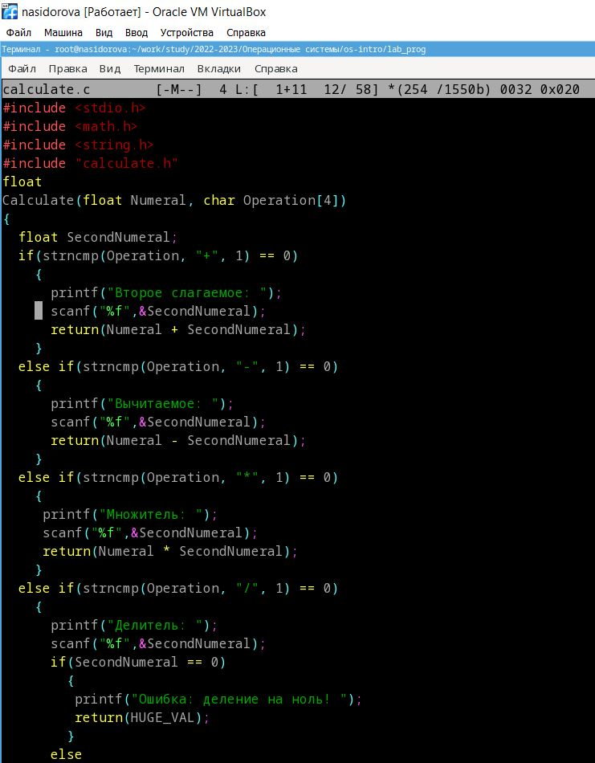
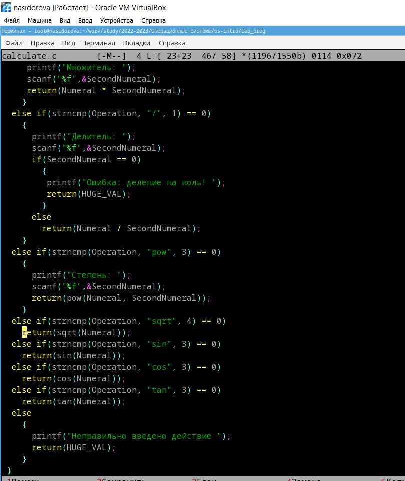
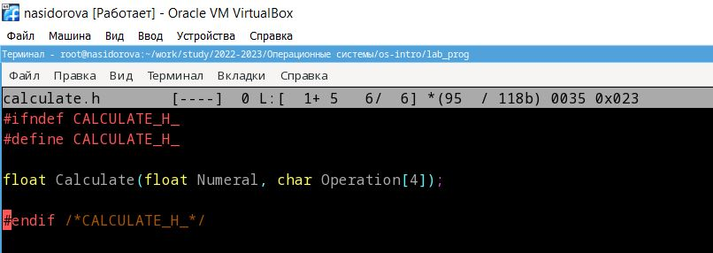
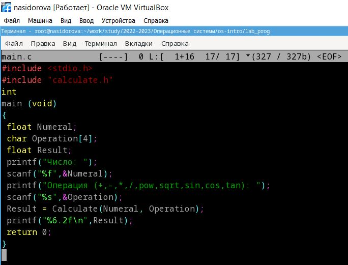
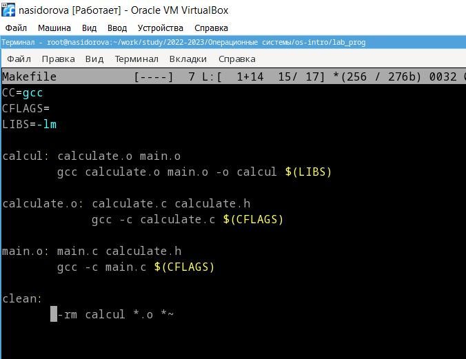
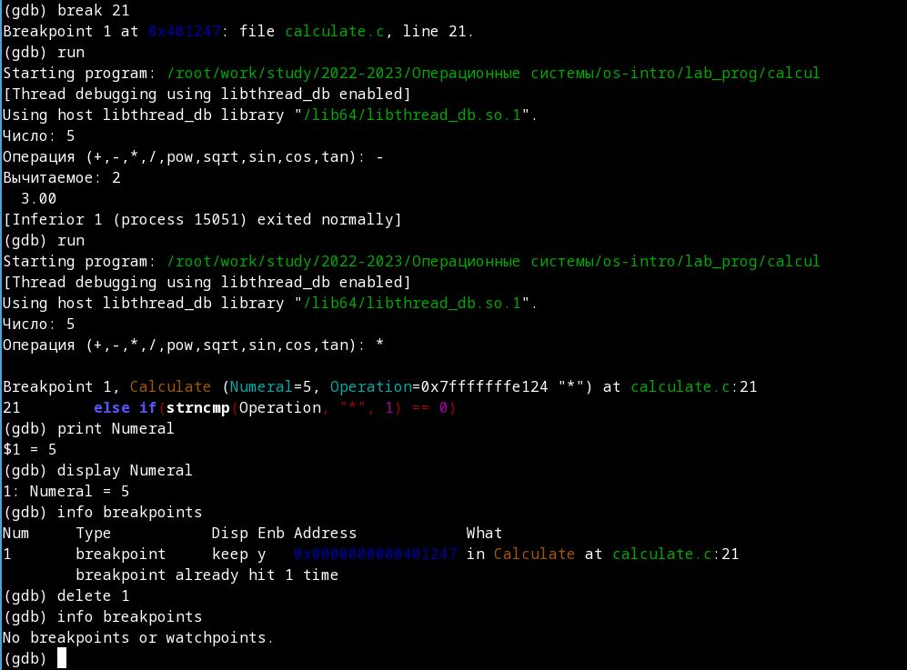

---
## Front matter
lang: ru-RU
title: "Презентация по лабораторной работе 13"
subtitle: Средства, применяемые при разработке программного обеспечения в ОС типа UNIX/Linux
author:
  - Сидорова Н.А.
institute:
  - Российский университет дружбы народов, Москва, Россия
  - Объединённый институт ядерных исследований, Дубна, Россия
date: 28 апреля 2023

## i18n babel
babel-lang: russian
babel-otherlangs: english

## Formatting pdf
toc: false
toc-title: Содержание
slide_level: 2
aspectratio: 169
section-titles: true
theme: metropolis
header-includes:
 - \metroset{progressbar=frametitle,sectionpage=progressbar,numbering=fraction}
 - '\makeatletter'
 - '\beamer@ignorenonframefalse'
 - '\makeatother'
---

## Цель работы

Приобрести простейшие навыки разработки, анализа, тестирования и отладки приложений в ОС типа UNIX/Linux на примере создания на языке программирования
С калькулятора с простейшими функциями

## 1 часть кода
В домашнем каталоге создала подкаталог ~/work/os/lab_prog. Создала в нём файлы: calculate.h, calculate.c, main.c.
Код в файле calculate.c 

{#fig:001 width=70%}

## 2 часть кода
{#fig:002 width=70%}

## Код вызова функции
Код в файле calculate.h 

{#fig:003 width=70%}

## Код интерфейса функции
Код в файле main.c. 

{#fig:004 width=70%}

## Отладка и код
Выполнила компиляцию программы посредством gcc. Создала Makefile 

{#fig:005 width=70%}

## Отладка программы
Запустила отладчик GDB. Запустила программу внутри него и попробовала ввести пример, вышел нужный результат. Просмотрела строки файлов. Установила точку установки, проверила что она работает и удалила ее. С помощью утилиты splint проанализировала коды файлов calculate.c и main.c 

{#fig:006 width=70%}

## Выводы

В процессе выполнения лабораторной работы я приобрела простейшие навыки разработки, анализа, тестирования и отладки приложений в ОС типа UNIX/Linux на примере создания на языке программирования С калькулятора с простейшими функциями.

