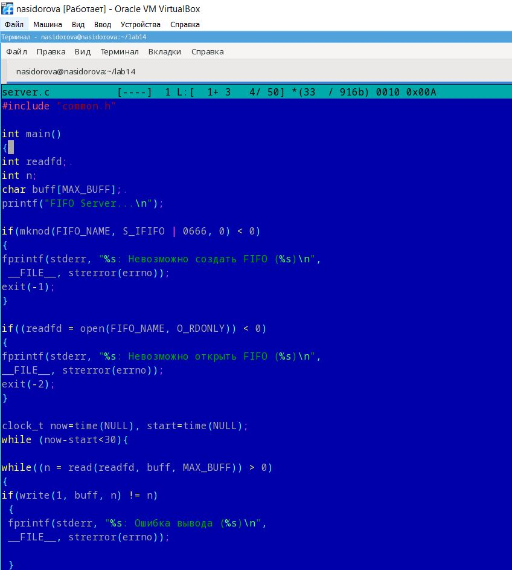
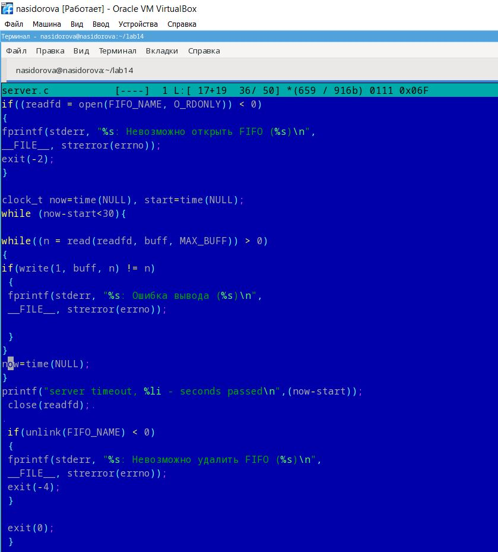
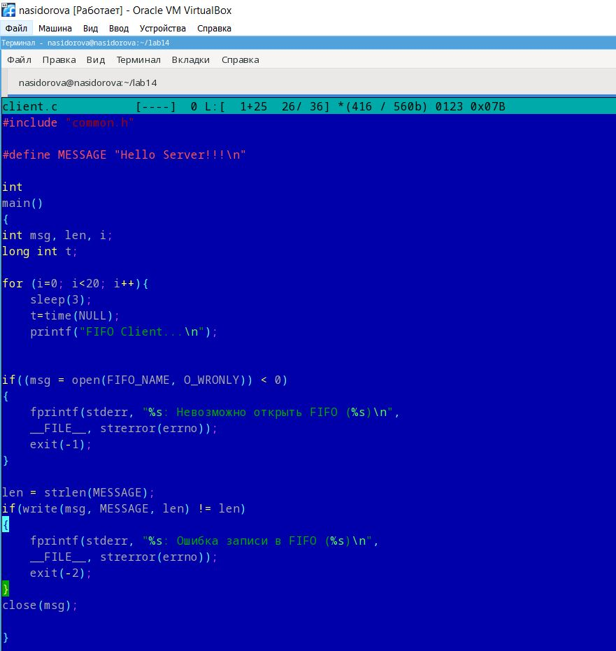
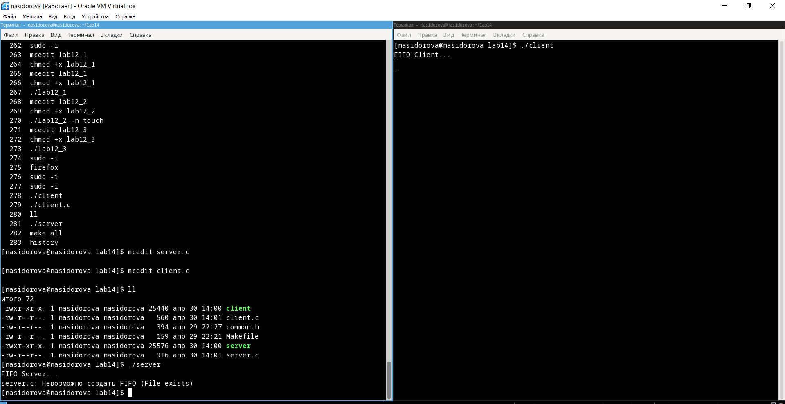

---
## Front matter
lang: ru-RU
title: "Презентация по лабораторной работе 14"
subtitle: Именованные каналы
author:
  - Сидорова Н.А.
institute:
  - Российский университет дружбы народов, Москва, Россия
  - Объединённый институт ядерных исследований, Дубна, Россия
date: 30 апреля 2023

## i18n babel
babel-lang: russian
babel-otherlangs: english

## Formatting pdf
toc: false
toc-title: Содержание
slide_level: 2
aspectratio: 169
section-titles: true
theme: metropolis
header-includes:
 - \metroset{progressbar=frametitle,sectionpage=progressbar,numbering=fraction}
 - '\makeatletter'
 - '\beamer@ignorenonframefalse'
 - '\makeatother'
---

## Цель работы

Приобретение практических навыков работы с именованными каналами.

## 1 часть кода server
Изменила код в файле server.c в соответствии с заданием 

{#fig:001 width=70%}

## 2 часть кода
{#fig:002 width=70%}

## Файл client
{#fig:003 width=70%}

## Работа файлов
{#fig:004 width=70%}

## Выводы

В процессе выполнения лабораторной работы я приобрела практические навыки работы с именованными каналами.

