---
## Front matter
title: "Отчёт по первому этапу итогового проекта"
subtitle: "Размещение на Github pages заготовки для персонального сайта"
author: "Сидорова Наталья Андреевна"

## Generic otions
lang: ru-RU
toc-title: "Содержание"

## Bibliography
bibliography: bib/cite.bib
csl: pandoc/csl/gost-r-7-0-5-2008-numeric.csl

## Pdf output format
toc: true # Table of contents
toc-depth: 2
lof: true # List of figures
lot: true # List of tables
fontsize: 12pt
linestretch: 1.5
papersize: a4
documentclass: scrreprt
## I18n polyglossia
polyglossia-lang:
  name: russian
  options:
	- spelling=modern
	- babelshorthands=true
polyglossia-otherlangs:
  name: english
## I18n babel
babel-lang: russian
babel-otherlangs: english
## Fonts
mainfont: PT Serif
romanfont: PT Serif
sansfont: PT Sans
monofont: PT Mono
mainfontoptions: Ligatures=TeX
romanfontoptions: Ligatures=TeX
sansfontoptions: Ligatures=TeX,Scale=MatchLowercase
monofontoptions: Scale=MatchLowercase,Scale=0.9
## Biblatex
biblatex: true
biblio-style: "gost-numeric"
biblatexoptions:
  - parentracker=true
  - backend=biber
  - hyperref=auto
  - language=auto
  - autolang=other*
  - citestyle=gost-numeric
## Pandoc-crossref LaTeX customization
figureTitle: "Рис."
tableTitle: "Таблица"
listingTitle: "Листинг"
lofTitle: "Список иллюстраций"
lotTitle: "Список таблиц"
lolTitle: "Листинги"
## Misc options
indent: true
header-includes:
  - \usepackage{indentfirst}
  - \usepackage{float} # keep figures where there are in the text
  - \floatplacement{figure}{H} # keep figures where there are in the text
---

# Цель работы

Разместить на Github pages заготовку для персонального сайта.

# Выполнение лабораторной работы

Скачала исполняемый файл Hugo, создала папку bin и поместила файл в нее (рис. @fig:001).

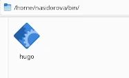{#fig:001 width=70%}

Использовав готовый шаблон, создала репозиторий blog (рис. @fig:002).

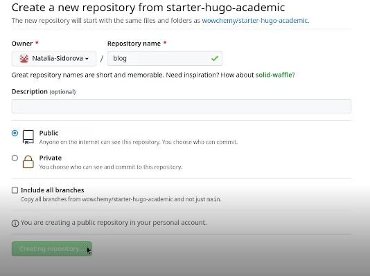{#fig:002 width=70%}

Клонировала этот репозиторий (рис. @fig:003).

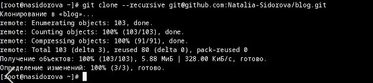{#fig:003 width=70%}

Активировала Hugo (рис. @fig:004).

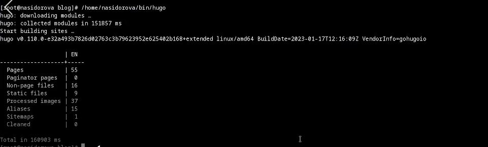{#fig:004 width=70%}

Удалила каталог public (рис. @fig:005).

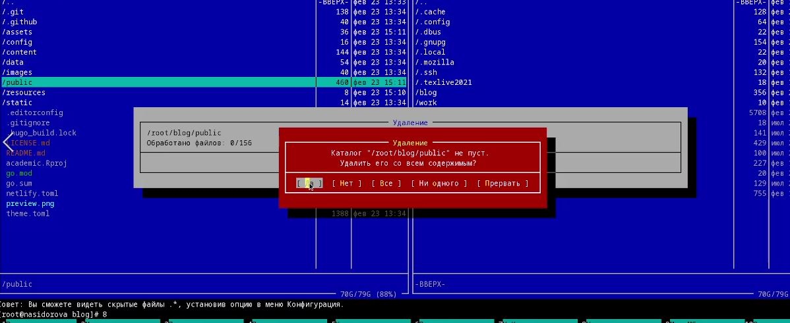{#fig:005 width=70%}

Перешла в hugo server (рис. @fig:006).

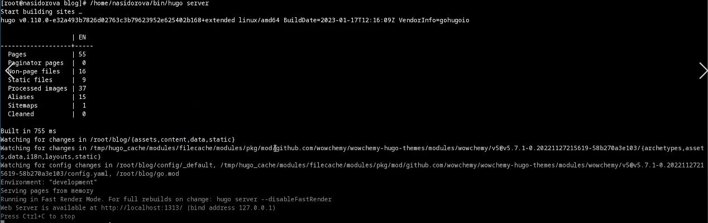{#fig:006 width=70%}

Скопировала появившуюся ссылку в браузер, открылся сайт без предупреждений, так как файла content/home/demo.md не было (рис. @fig:007).

{#fig:007 width=70%}

Создала репозиторий с именем nasidorova.github.io (рис. @fig:008).

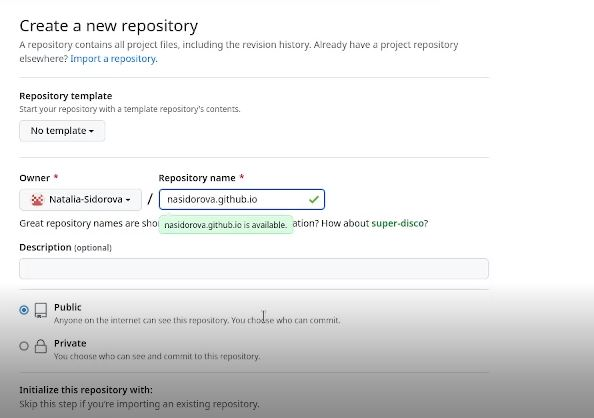{#fig:008 width=70%}

Клонировала созданный репозиторий (рис. @fig:009).

{#fig:009 width=70%}

В новом пустом репозитории создала ветку main (рис. @fig:010).

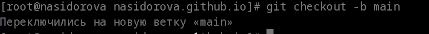{#fig:010 width=70%}

Создала пустой файл и отправила его на github (рис. @fig:011).

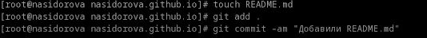{#fig:011 width=70%}

Подключила созданный репозиторий к папке public, возникшая ошибка была исправлена путем изменения файла .gitignore (рис. @fig:012).

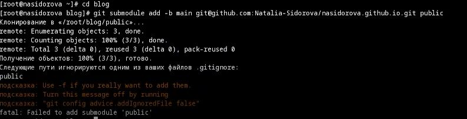{#fig:012 width=70%}

Выполнила команду /home/nasidorova/bin/hugo находясь в каталоге blog и в каталоге public появились новые файлы (рис. @fig:013).

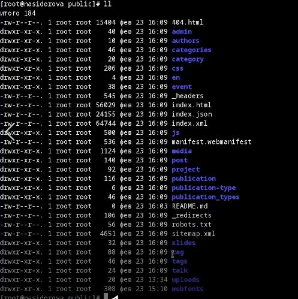{#fig:013 width=70%}

Синхронизировала файлы с репозиторием (рис. @fig:014).

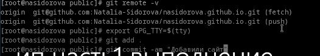{#fig:014 width=70%}

Созданный сайт заработал (рис. @fig:015).

{#fig:015 width=70%}

# Выводы

В ходе проделанной работы я создала заготовку для персонального сайта и разместила ее на Github pages.

# Список литературы{.unnumbered}

::: {#refs}
:::
