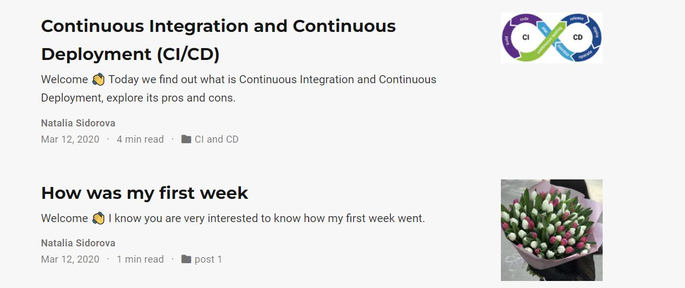

---
## Front matter
lang: ru-RU
title: Презентация ко второму этапу индивидуального проекта
subtitle: Добавление данных о себе
author:
  - Сидорова Н.А.
institute:
  - Российский университет дружбы народов, Москва, Россия
  - Объединённый институт ядерных исследований, Дубна, Россия
date: 12 марта 2023

## i18n babel
babel-lang: russian
babel-otherlangs: english

## Formatting pdf
toc: false
toc-title: Содержание
slide_level: 2
aspectratio: 169
section-titles: true
theme: metropolis
header-includes:
 - \metroset{progressbar=frametitle,sectionpage=progressbar,numbering=fraction}
 - '\makeatletter'
 - '\beamer@ignorenonframefalse'
 - '\makeatother'
---

## Цель работы

Продолжить работу со своим сайтом. Добавить данные о себе на сайт. Выложить несколько постов.

## Задание

1. Список добавляемых данных: фотография владельца сайта, краткое описание владельца сайта (Biography), информация об интересах (Interests), информация от образовании (Education).
2. Сделать пост по прошедшей неделе.
3. Добавить пост на тему по выбору: управление версиями. Git или непрерывная интеграция и непрерывное развертывание (CI/CD).

## Теоретическое введение

Сайт – это совокупность веб-страниц, объединённых под общим доменом и связанных ссылками, тематикой и дизайнерским оформлением. Мы будем создавать статический сайт, для этого нам понадобится Hugo. Hugo — генератор статических страниц для интернета.
Мы продолжаем работу с Hugo. Будем учиться редактировать данные о себе и писать посты.

## Размещение данных на сайте 

Я разместила свою фотографию на сайт, а также некоторые данные (рис. @fig:001).

{#fig:001 width=70%}

## Размещение фотографии

Чтобы разместить фотографию, добавила ее в папку admin, переименовала файл в avatar, а прошлый файл удалила (рис. @fig:002).

{#fig:002 width=70%}

## Редактирование информации

Перешла в файл index.md и изменила информацию о себе - указала имя, профессию, учебную организацию, интересы и пройденные курсы (рис. @fig:003).

{#fig:003 width=70%}

## Посты на сайте

Сделала пост о прошедшей неделе и пост по теме "Непрерывная интеграция и непрерывное развертывание (CI/CD)" (рис. @fig:004).

{#fig:004 width=70%}

## Создание поста

Для этого в папке post создала каталоги 1_week и CI_CD, скопировала в них файл с шаблоном поста и изменила в соответствии со своими постами (рис. @fig:005).

{#fig:005 width=70%}

## Выводы 

В ходе выполнения второго этапа индивидуального проекта я научилась редактировать данные о себе, писать посты и добавлять их на сайт.

:::

