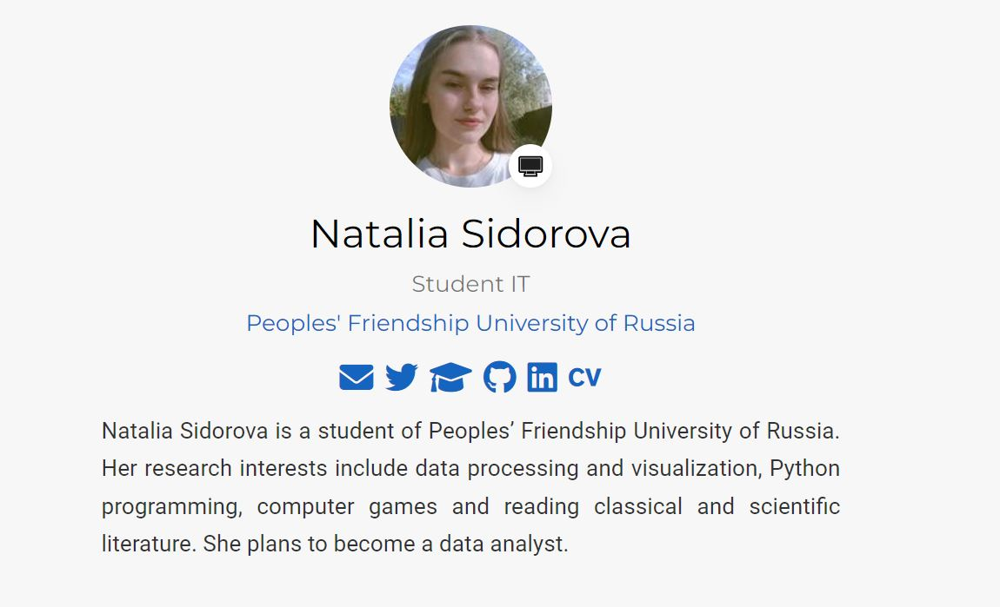
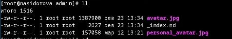
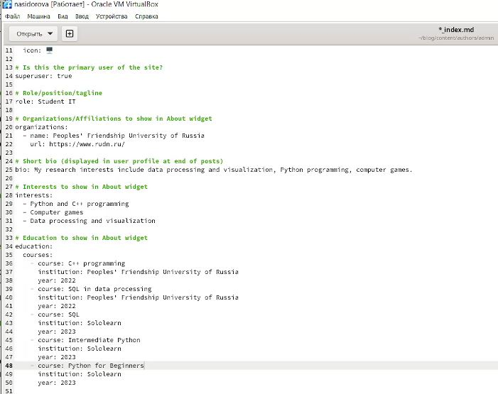
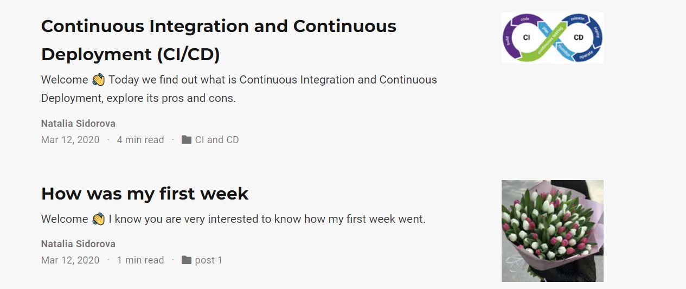
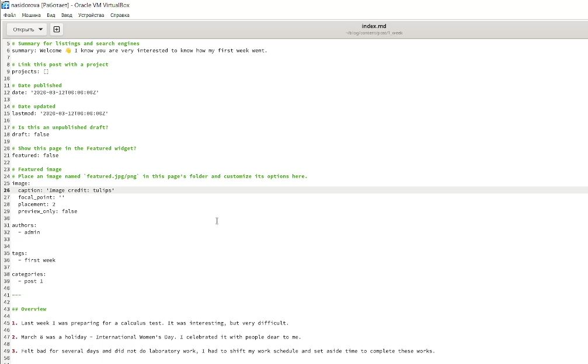
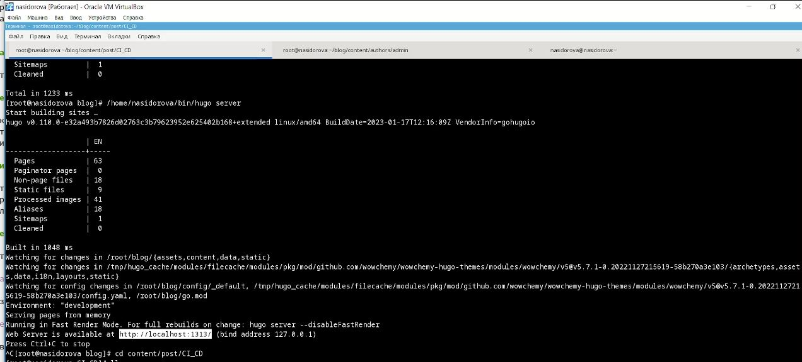

---
## Front matter
title: "Отчёт по второму этапу индивидуального проекта"
subtitle: "Добавление данных о себе"
author: "Сидорова Наталья Андреевна"

## Generic otions
lang: ru-RU
toc-title: "Содержание"

## Bibliography
bibliography: bib/cite.bib
csl: pandoc/csl/gost-r-7-0-5-2008-numeric.csl

## Pdf output format
toc: true # Table of contents
toc-depth: 2
lof: true # List of figures
lot: true # List of tables
fontsize: 12pt
linestretch: 1.5
papersize: a4
documentclass: scrreprt
## I18n polyglossia
polyglossia-lang:
  name: russian
  options:
	- spelling=modern
	- babelshorthands=true
polyglossia-otherlangs:
  name: english
## I18n babel
babel-lang: russian
babel-otherlangs: english
## Fonts
mainfont: PT Serif
romanfont: PT Serif
sansfont: PT Sans
monofont: PT Mono
mainfontoptions: Ligatures=TeX
romanfontoptions: Ligatures=TeX
sansfontoptions: Ligatures=TeX,Scale=MatchLowercase
monofontoptions: Scale=MatchLowercase,Scale=0.9
## Biblatex
biblatex: true
biblio-style: "gost-numeric"
biblatexoptions:
  - parentracker=true
  - backend=biber
  - hyperref=auto
  - language=auto
  - autolang=other*
  - citestyle=gost-numeric
## Pandoc-crossref LaTeX customization
figureTitle: "Рис."
tableTitle: "Таблица"
listingTitle: "Листинг"
lofTitle: "Список иллюстраций"
lotTitle: "Список таблиц"
lolTitle: "Листинги"
## Misc options
indent: true
header-includes:
  - \usepackage{indentfirst}
  - \usepackage{float} # keep figures where there are in the text
  - \floatplacement{figure}{H} # keep figures where there are in the text
---

# Цель работы

Продолжить работу со своим сайтом. Добавить данные о себе на сайт. Выложить несколько постов.

# Задание

1. Список добавляемых данных: фотография владельца сайта, краткое описание владельца сайта (Biography), информация об интересах (Interests), информация от образовании (Education).
2. Сделать пост по прошедшей неделе.
3. Добавить пост на тему по выбору: управление версиями. Git или непрерывная интеграция и непрерывное развертывание (CI/CD).

# Теоретическое введение

Сайт – это совокупность веб-страниц, объединённых под общим доменом и связанных ссылками, тематикой и дизайнерским оформлением. Мы будем создавать статический сайт, для этого нам понадобится Hugo. Hugo — генератор статических страниц для интернета.
Мы продолжаем работу с Hugo. Будем учиться редактировать данные о себе и писать посты.

# Выполнение лабораторной работы

Я разместила свою фотографию на сайт, а также некоторые данные (рис. @fig:001).

{#fig:001 width=70%}

Чтобы разместить фотографию, добавила ее в папку admin, переименовала файл в avatar, а прошлый файл удалила (рис. @fig:002).

{#fig:002 width=70%}

Перешла в файл index.md и изменила информацию о себе - указала имя, профессию, учебную организацию, интересы и пройденные курсы (рис. @fig:003).

{#fig:003 width=70%}

Сделала пост о прошедшей неделе и пост по теме "Непрерывная интеграция и непрерывное развертывание (CI/CD)" (рис. @fig:004).

{#fig:004 width=70%}

Для этого в папке post создала каталоги 1_week и CI_CD, скопировала в них файл с шаблоном поста и изменила в соответствии со своими постами (рис. @fig:005).

{#fig:005 width=70%}

Отправила посты и измененную информацию на сайт и на гитхаб (рис. @fig:006).

{#fig:006 width=70%}

# Выводы

В ходе выполнения второго этапа индивидуального проекта я научилась редактировать данные о себе, писать посты и добавлять их на сайт.

# Список литературы{.unnumbered}

::: {#refs}
:::
