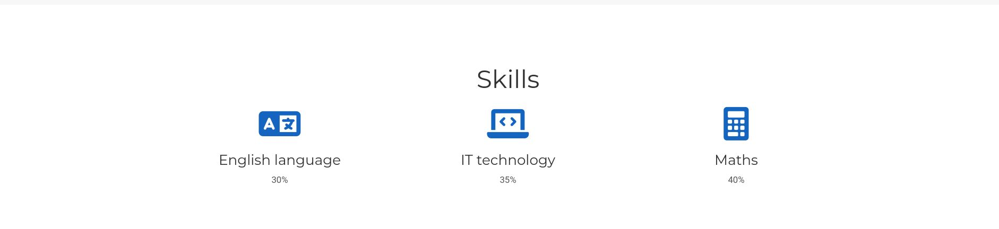

---
## Front matter
lang: ru-RU
title: "Презентация к 3 этапу проекта"
subtitle: Операционные системы
author:
  - Сидорова Наталья Андреевна
institute:
  - Российский университет дружбы народов, Москва, Россия
  - Объединённый институт ядерных исследований, Дубна, Россия
date: 3 апреля 2023

## i18n babel
babel-lang: russian
babel-otherlangs: english

## Formatting pdf
toc: false
toc-title: Содержание
slide_level: 2
aspectratio: 169
section-titles: true
theme: metropolis
header-includes:
 - \metroset{progressbar=frametitle,sectionpage=progressbar,numbering=fraction}
 - '\makeatletter'
 - '\beamer@ignorenonframefalse'
 - '\makeatother'
---

## Цель работы

Продолжить редактирование личного сайта. Добавить к сайту достижения.

## Задание

Добавить информацию о навыках, добавить информацию об опыте, добавить информацию о достижениях.
Сделать пост по прошедшей неделе, добавить пост на тему язык разметки Markdown.

## Навыки 
 Добавила информацию о навыках 

{#fig:001 width=70%}

## Опыт
 Добавила информацию об опыте 

{#fig:002 width=70%} 

## Достижения
Добавила информацию о достижениях 

{#fig:003 width=70%} 

## Посты
Добавила пост о прошедшей неделе и о языке разметки Markdown 

{#fig:004 width=70%} 

## Выводы

В процессе выполнения третьего этапа индивидуального проекта я продолжила редактирование сайта, научилась добавлять на сайт свои достижения, а также продолжила писать посты.

:::

