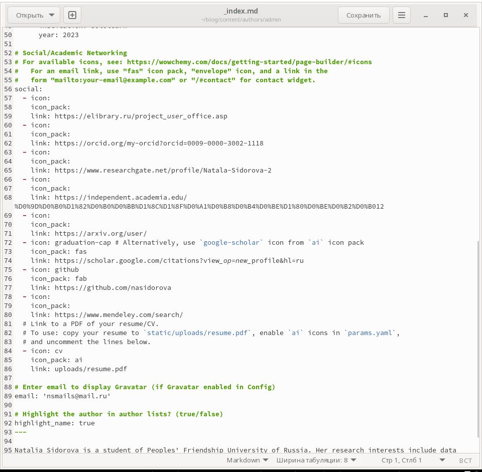
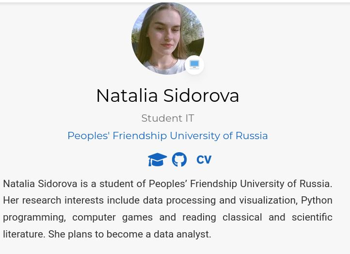
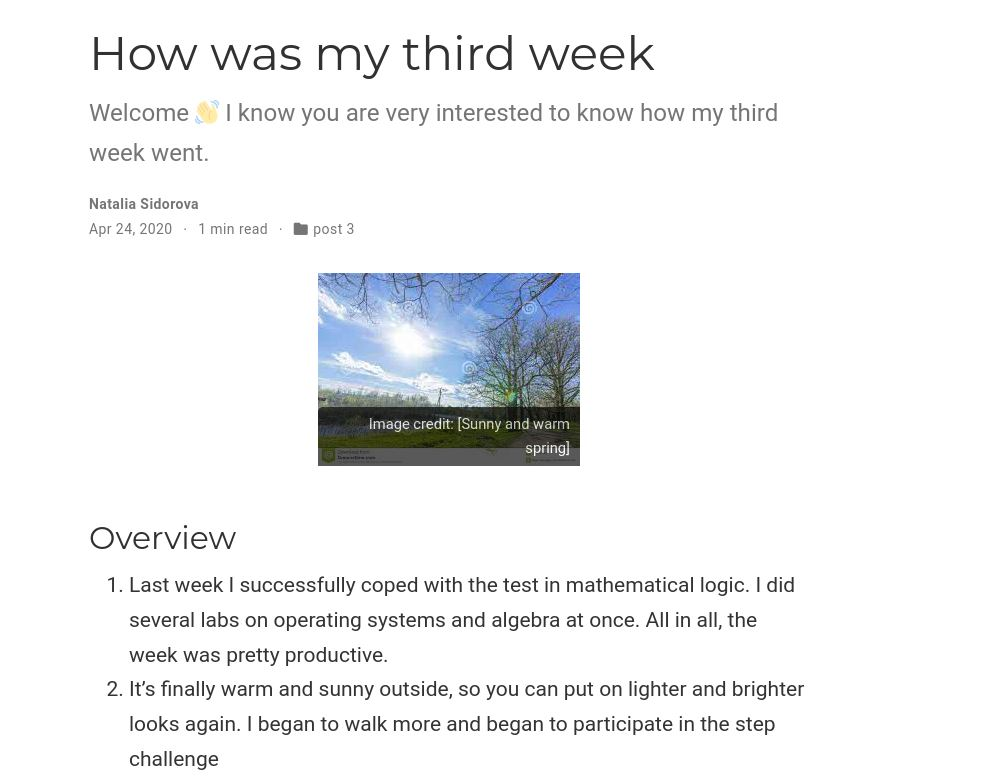
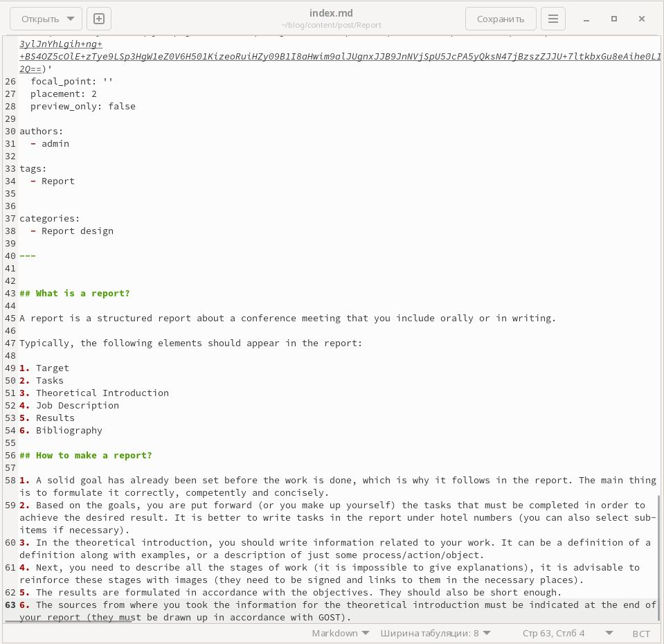
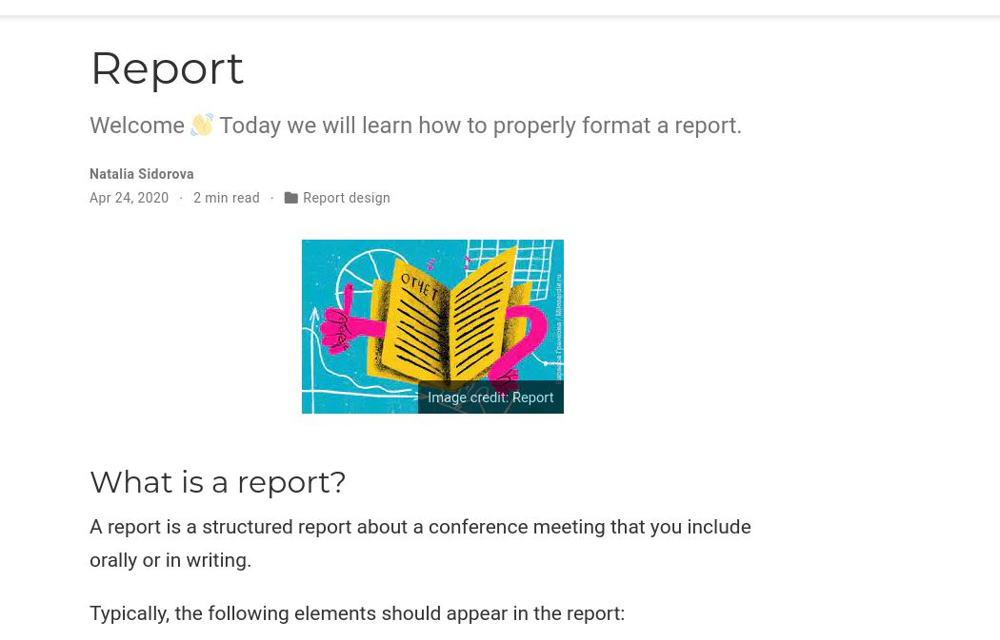

---
## Front matter
lang: ru-RU
title: "Презентация к 4 этапу проекта"
subtitle: 4 этап проекта
author:
  - Сидорова Н.А.
institute:
  - Российский университет дружбы народов, Москва, Россия
  - Объединённый институт ядерных исследований, Дубна, Россия
date: 24 апреля 2023

## i18n babel
babel-lang: russian
babel-otherlangs: english

## Formatting pdf
toc: false
toc-title: Содержание
slide_level: 2
aspectratio: 169
section-titles: true
theme: metropolis
header-includes:
 - \metroset{progressbar=frametitle,sectionpage=progressbar,numbering=fraction}
 - '\makeatletter'
 - '\beamer@ignorenonframefalse'
 - '\makeatother'
---

## Задание

Разместить ссылки на научные ресурсы на сайте.
Сделать пост по прошедшей неделе.
Добавить пост на тему по выбору:
1. Оформление отчёта
2. Создание презентаций
3. Работа с библиографией

## Добавление ссылок
Добавила ссылки на научные и библиометрические ресурсы. 

{#fig:001 width=70%}

## Ссылки на сайте 
Ссылки появлись на сайте под фотографией 

{#fig:004 width=70%}

## Создание поста
Сделала пост по прошедшей неделе 

{#fig:002 width=70%}

## Пост о прошедщей неделе
Добавила пост на сайт 

{#fig:005 width=70%}

## Создание поста
Сделала пост про оформление отчета 

{#fig:003 width=70%}

## Пост об оформлении отчета
Добавила его на сайт 

{#fig:006 width=70%}

## Выводы

В процессе выполнения этого этапа проекта я добавила на сайт ссылки на свои научные аккаунты, а также написала два поста.
