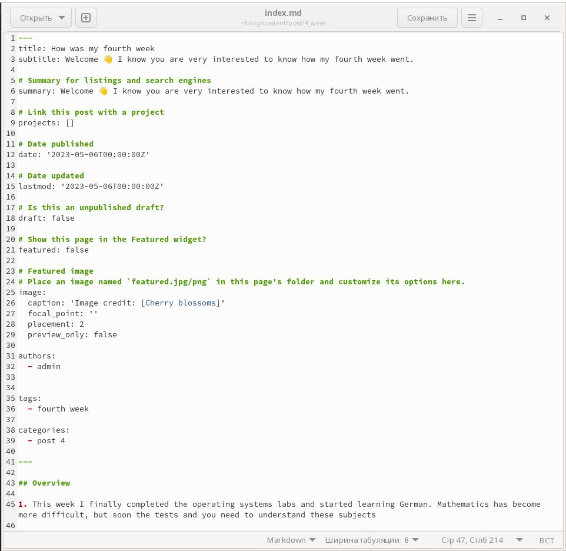
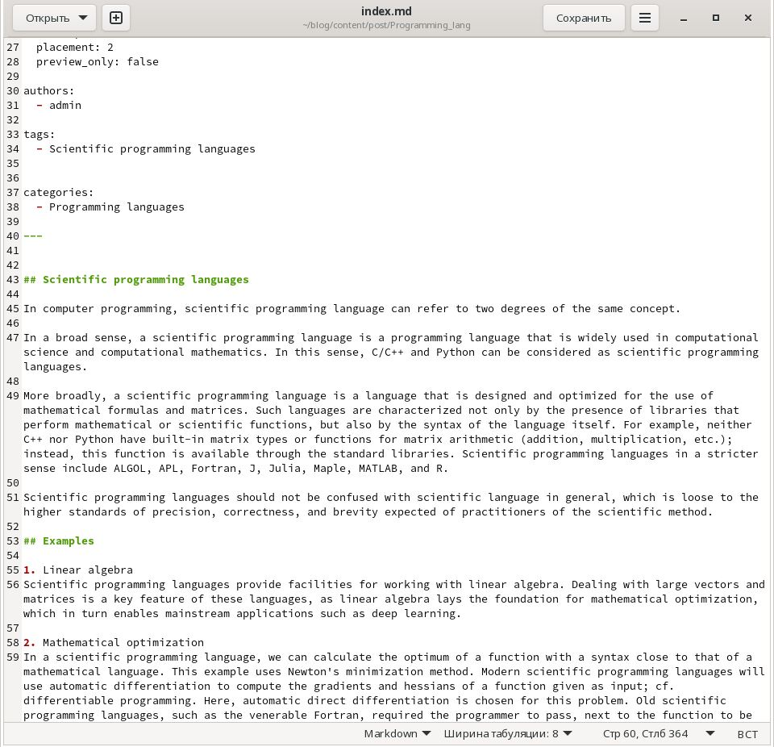
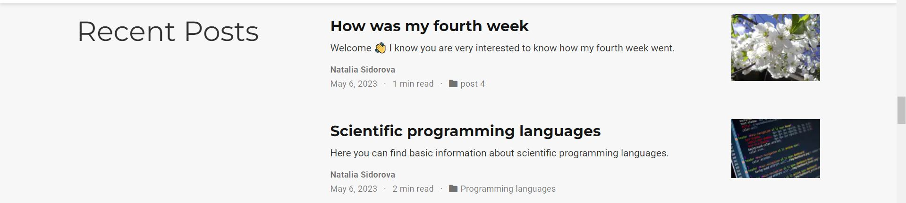

---
## Front matter
lang: ru-RU
title: "Отчёт к 5 этапу проекта"
subtitle: Добавление к сайту оставшихся элементов
author:
  - Сидорова Н.А.
institute:
  - Российский университет дружбы народов, Москва, Россия
  - Объединённый институт ядерных исследований, Дубна, Россия
date: 06 мая 2023

## i18n babel
babel-lang: russian
babel-otherlangs: english

## Formatting pdf
toc: false
toc-title: Содержание
slide_level: 2
aspectratio: 169
section-titles: true
theme: metropolis
header-includes:
 - \metroset{progressbar=frametitle,sectionpage=progressbar,numbering=fraction}
 - '\makeatletter'
 - '\beamer@ignorenonframefalse'
 - '\makeatother'
---

## Задание

1. Сделать записи для персональных проектов.
2. Сделать пост по прошедшей неделе.
3. Добавить пост на тему "Языки научного программирования".

## Пост о прошедшей неделе

Добавила пост по прошедшей неделе .

{#fig:001 width=70%}

## Пост о языках программирования

Добавила пост на тему "Языки научного программирования".

{#fig:002 width=70%}

## Посты на сайте

Добавила посты на сайт.

{#fig:003 width=70%}

## Выводы

В процессе выполнения этого этапа индивидуального проекта я продолжила редактирование своего научного сайта. Научилась добавлять записи для персональных проектов.

